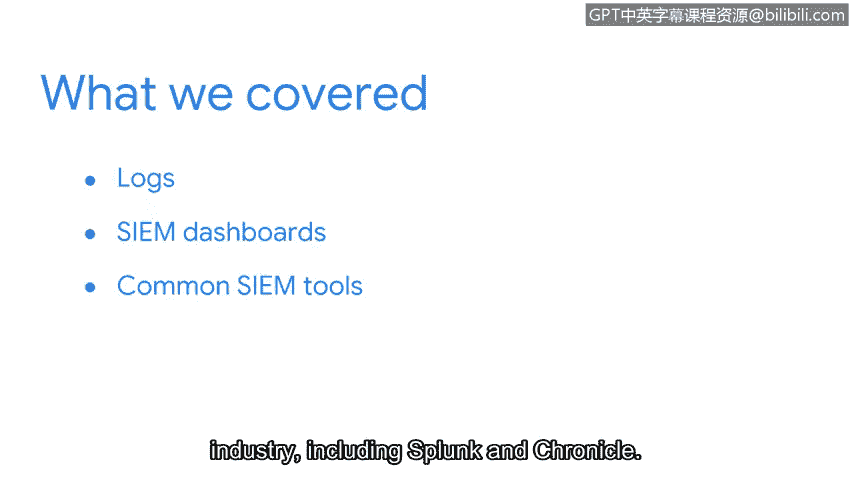

**谷歌网络安全专业证书课程：第二课：安全风险管理：P63：章节回顾与总结**

在本节课程中，我们重点探讨了安全信息管理中的核心组成部分。我们首先了解了日志在网络安全中的基础作用，然后学习了如何通过SIEM工具及其可视化仪表板来高效地分析和呈现这些安全数据。

---

上一节我们介绍了SIEM工具的基本功能，本节中我们来快速回顾一下本部分涵盖的核心内容。

我们首先讨论了**日志**在网络安全中的重要性。日志是系统和网络活动的详细记录，是安全分析的基础数据源。

接下来，我们探讨了不同的日志类型，例如：
*   **防火墙日志**
*   **网络日志**
*   **服务器日志**

在理解了日志之后，我们进一步探索了**SIEM仪表板**。SIEM仪表板利用图表、图形等视觉化呈现方式，为安全团队提供快速、清晰的组织安全态势洞察。

最后，我们介绍了网络安全行业中常用的**SIEM工具**，其中两个典型的代表是：
*   **Splunk**
*   **Chronle**

---

本课程后续部分将深入探索更多安全工具，并提供实践使用的机会。接下来，我们将讨论**预案手册**，以及它们如何帮助安全专业人员对已识别的威胁、风险和漏洞做出恰当的响应。我们下一节再见。

**总结**
本节课我们一起学习了网络安全中日志的核心作用、常见的日志类型、SIEM仪表板的可视化优势以及业界主流的SIEM工具。这些知识构成了安全监控与事件分析的基础。