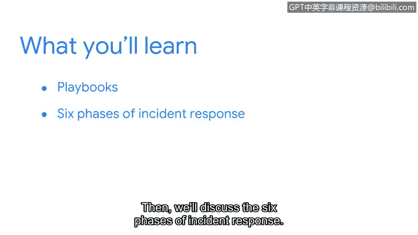

# 064：欢迎来到第四周

在本节课中，我们将学习安全团队用于应对威胁和漏洞的重要工具——**剧本**。我们将探讨剧本如何与SIEM工具协同工作，并详细介绍事件响应的六个阶段。

---

上一节我们讨论了安全信息与事件管理工具及其如何帮助组织提升安全态势。本节中，我们来看看安全专业人员使用的另一个工具：**剧本**。

剧本帮助安全团队响应由SIEM工具识别出的威胁、风险或漏洞。接下来，我们将讨论事件响应的六个阶段。

让我们开始吧。