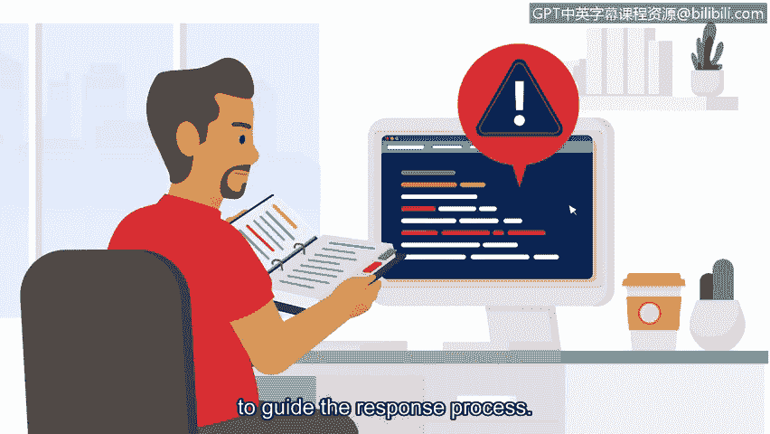

# 065：事件响应手册的六个阶段 🛡️

## 概述

在本节课中，我们将要学习一个在网络安全领域至关重要的工具——**事件响应手册**。我们将了解它的定义、重要性，并详细拆解其标准化的六个响应阶段。

上一节我们介绍了SIEM工具如何帮助保护组织的关键资产和数据。本节中，我们来看看另一个用于维护组织安全的重要工具：事件响应手册。

## 什么是事件响应手册？

**事件响应手册**是一份提供任何操作行动细节的手册。在安全领域，手册明确了应对安全事件时应使用何种工具。

手册至关重要。快速识别并缓解安全威胁以减少潜在风险，需要紧迫性、高效性和准确性。手册确保无论由谁处理事件，人们都能以规定的方式遵循一致的行动列表。

组织会使用不同类型的手册，包括用于事件响应、安全警报、特定团队和特定产品的手册。这里我们将重点介绍网络安全中常用的一种手册：事件响应手册。

**事件响应**是组织为识别攻击、控制损害并纠正安全漏洞影响而进行的快速尝试。**事件响应手册**则是一个包含六个阶段的指南，用于帮助从头到尾缓解和管理安全事件。

以下是事件响应手册的六个阶段。

## 六个阶段详解

### 第一阶段：准备

组织必须通过记录程序、建立人员配置计划以及教育用户，为减轻安全事件的可能性、风险和影响做好准备。准备为成功的事件响应奠定了基础。

例如，组织可以创建事件响应计划和程序，概述每个安全团队成员的**角色和职责**。

### 第二阶段：检测与分析

此阶段的目标是使用已定义的流程和技术来检测和分析事件。在此阶段使用适当的工具和策略，有助于安全分析师确定是否发生了违规行为，并分析其可能的影响范围。

### 第三阶段：遏制

遏制的目标是防止进一步的损害，并减少安全事件的直接影响。在此阶段，安全专业人员采取行动来遏制事件并最小化损害。遏制对组织来说是高度优先的事项，因为它有助于防止对关键资产和数据的持续风险。

### 第四阶段：根除与恢复

此阶段涉及完全移除事件的所有痕迹，以便组织能够恢复正常运营。在此阶段，安全专业人员通过移除恶意代码和修复漏洞来消除事件的痕迹。一旦他们履行了应有的勤勉，就可以开始将受影响的环境恢复到安全状态。这也被称为**IT恢复**。

### 第五阶段：事后活动

此阶段包括记录事件、通知组织领导层，以及应用经验教训，以确保组织能更好地应对未来事件。根据事件的严重程度，组织可以进行全面的事件分析，以确定事件的根本原因，并实施各种更新或改进，以增强其整体安全态势。

### 第六阶段：协调

协调涉及根据组织既定的标准，在整个事件响应过程中报告事件和共享信息。协调非常重要，原因有很多。它确保组织满足合规性要求，并允许进行协调的响应和解决。

## 手册与工具的协同

安全专业人员可以通过多种方式获知事件。您最近学习了SIEM工具及其如何收集和分析数据。它们利用这些数据来检测威胁并生成警报，从而通知安全团队潜在事件。然后，当安全分析师收到类似的警报时，他们可以使用相应的事件响应手册来指导响应过程。

**SIEM工具和事件响应手册协同工作，为响应潜在安全事件提供了一种结构化且高效的方式。**

## 总结

本节课中，我们一起学习了事件响应手册的核心概念。我们了解到，手册是一套标准化的操作指南，它通过**准备、检测与分析、遏制、根除与恢复、事后活动、协调**这六个阶段，系统地指导安全团队应对安全事件，确保响应过程的效率、一致性与合规性。手册与SIEM等工具结合，共同构成了组织安全防御体系的关键组成部分。