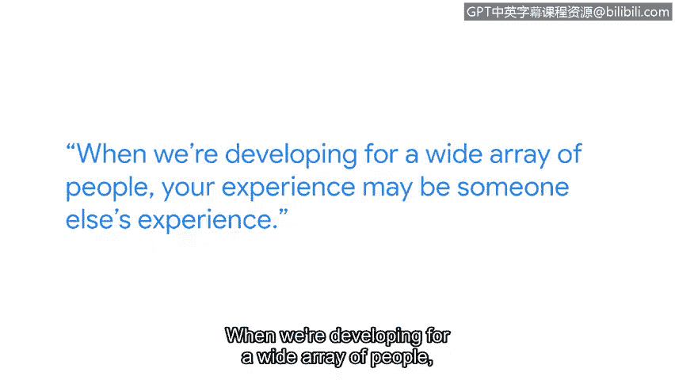

# 068：视角多样性在安全团队中的重要性

## 概述

在本节课程中，我们将探讨安全团队中视角多样性的重要性。我们将了解不同的个人背景和思维方式如何为技术产品的开发，尤其是在隐私和安全方面，带来更全面、更公平的解决方案。

## 主讲人介绍

大家好，我是艾琳，谷歌的一名隐私工程师。

我的工作聚焦于推测性和新兴技术领域，主要研究那些目前尚不存在，但预计在未来两到五年内会出现的技术。我的核心职责是审视我们正在创造的所有技术，并确保隐私保护从一开始就被嵌入其中。

## 核心理念：隐私前置

我的工作是在用户接触产品之前，就为他们考虑周全。目标是确保当用户使用我们的产品时，他们能够信任与产品的互动，并且知道我们正在保护他们的隐私——那些他们不希望分享或公开的信息——确保他们在接触产品之前就已充分知情。

## 软技能 vs. 技术技能

我始终认为，**软技能比技术技能更重要**。原因在于，技术可以教授，但如何与人建立联系、理解他人是无法被简单教授的，这是你个人带来的独特价值。

## 视角多样性的价值

思想与视角的多样性对于理解我们所处的世界非常有用。因为如果我们为普罗大众设计产品，就需要大众来帮助我们理解这些视角。

*   **个人视角差异**：我可能以一种方式看待事物，但我的同事基于其自身经历可能会有不同的看法。
*   **协作产生深度**：当来自不同环境的人一起工作时，你们实际上为所审视的事物带来了更多的公平性和深度。

## 你的视角是产品改进的关键

你所带来的视角，是让产品变得更好的**必要声音**。例如，团队中如果有来自新闻业或娱乐业背景的成员（就像我一样），他们会带来截然不同的处理问题的视角。

假设我们有一个产品方案，需要说服产品团队“也许我们不应该这样做”。这时，如果有来自新闻业的同事提出：“从新闻工作者的角度看，我们真的希望这个功能登上《纽约时报》的头条吗？很可能不希望。”这种基于实际经验的论证方式，更能让团队成员理解问题的严重性。

## 你的经历独一无二

从你出生到现在，所有的经历都构成了你独特的经验库。在面向广大人群进行技术开发时，我们必须考虑到这一点。

**你的经验，可能就是他人的经验。** 如果讨论室里没有你，我们就失去了为解决方案增添一份独特而宝贵视角的机会。这正是我鼓励人们加入技术行业、参与STEM（科学、技术、工程、数学）领域的原因。

## 总结

本节课我们一起学习了视角多样性在安全与隐私团队中的核心作用。无论是产品开发、安全还是隐私保护，乃至软件工程等所有领域，都需要不同的声音，而其中**必不可少的就是你的声音**。你的背景、经历和独特视角，是构建更公平、更全面、更值得信赖的技术产品的关键要素。