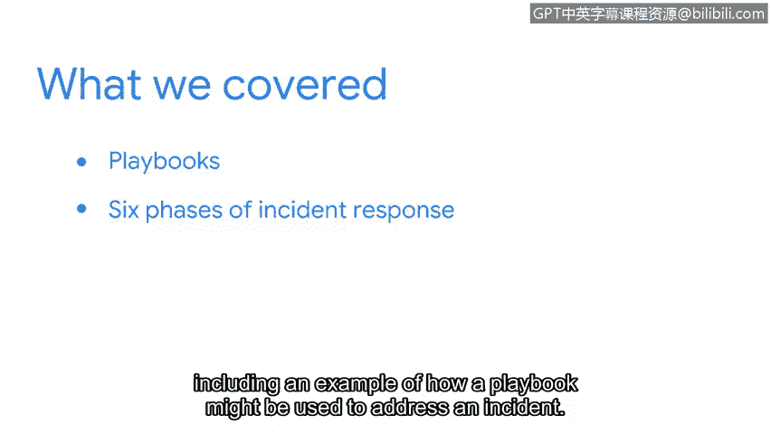

# 069：章节回顾与总结 🎯

在本节中，我们探讨了安全分析师在处理事件时使用的一种关键工具——预案手册。接下来，让我们一起回顾本节的核心内容。

## 本节内容回顾 📝

我们首先讨论了预案手册的目的。预案手册为安全团队提供了一套结构化的操作指南，确保在面对安全事件时能够采取一致且有效的应对措施。

随后，我们详细分析了事件响应预案手册的六个阶段。这六个阶段构成了一个完整的响应循环，指导分析师从事件发现到事后总结的全过程。

为了加深理解，我们还研究了一个具体的示例，展示了如何运用预案手册来实际处理一起安全事件。这个示例帮助我们直观地理解了理论在实践中的应用方式。

## 核心要点总结 💡

预案手册是安全分析师必备的核心工具之一。它通过提供**结构化的、一致的**方法来处理安全事件，能帮助你快速响应。

掌握**何时以及如何使用**预案手册，将使你能够在安全事件发生时，就如何响应做出明智的决策。这有助于最大限度地减少事件可能对你的组织及其服务对象造成的**影响和损害**。

遵循预案手册的步骤，并与你的团队进行**恰当的沟通**，将确保你作为一名安全专业人员的有效性。

---

本节课中，我们一起学习了预案手册的重要性、其包含的六个响应阶段，以及如何通过实际应用来有效管理安全风险。掌握这些知识是成为一名合格安全分析师的基础。