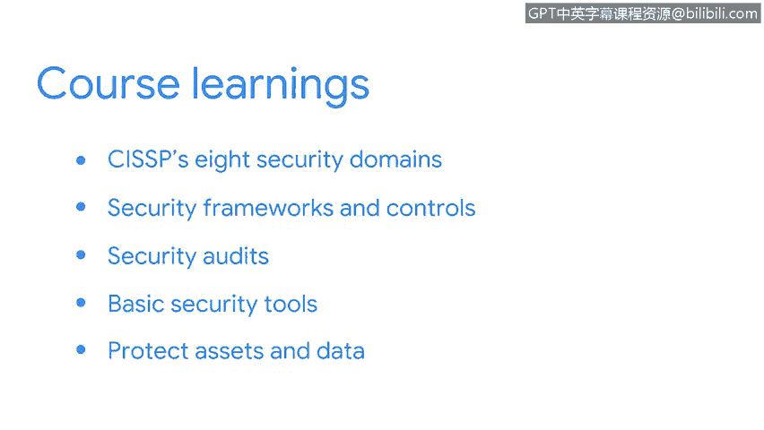

# 070：课程总结 🎯

在本节课中，我们一起回顾了《安全风险管理》课程的核心内容，涵盖了从基础概念到实用工具的关键知识。

## 课程内容回顾 📚

首先，我们回顾了CISSP的8个安全域，并重点关注了威胁、风险和对业务运营的脆弱性。

上一节我们介绍了安全的基础范畴，本节中我们来看看如何构建防御体系。我们探讨了安全框架与控制措施，以及它们如何作为创建安全管理策略和流程的起点。这包括对**CIA三要素**（机密性、完整性、可用性）、**NIST框架**和安全设计原则的讨论，并分析了它们如何使整个安全社区受益。

在理解了框架和原则之后，我们进一步探讨了它们与安全审计的关系。我们研究了安全审计如何评估这些控制措施的有效性。

以下是本课程涉及的基本安全工具：
*   安全信息和事件管理仪表盘等工具。
*   这些工具如何被用于保护业务运营。

最后，我们学习了如何通过使用预案来保护资产和数据。

## 知识应用与展望 🚀

作为一名安全分析师，你可能需要同时处理多项任务。理解你所掌握的工具及其使用方法，将提升你在该领域的专业知识，同时帮助你成功完成日常工作。

在接下来的课程中，我的同事Chris将提供更多关于本课程所涵盖主题的细节，并向你介绍一些新的核心安全概念。

## 总结

本节课中我们一起学习了安全风险管理的核心框架、控制措施、审计流程以及基础防护工具。这些知识构成了网络安全实践的基石。很高兴能与你共同完成这段学习旅程。