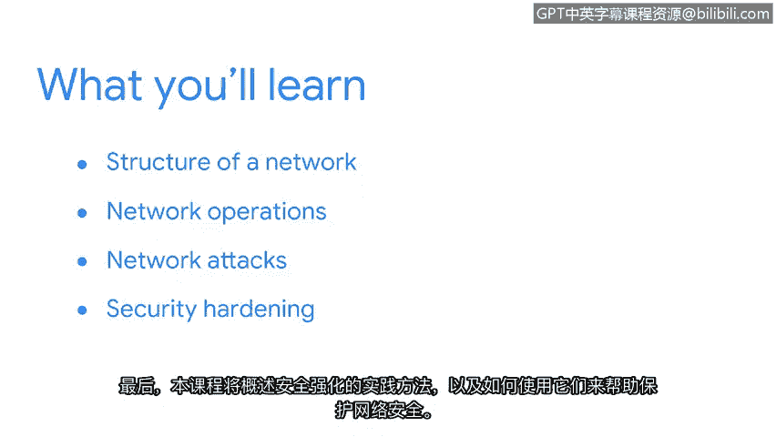

# 001：课程介绍

在本节课中，我们将学习网络与网络安全的基础知识。课程将涵盖网络架构、常用工具、网络协议、常见攻击方式以及安全加固实践。通过本课程，您将建立起对网络安全核心概念的理解。

您在前面的课程中已经学习了安全领域的基础知识。现在，我们将深入探讨其中一个关键领域：网络。

保护网络至关重要，因为基于网络的攻击在频率和复杂性上都在不断增长。

我是Chris，担任Google Fiber的首席信息安全官。我很荣幸能担任本课程的讲师。我在网络安全和工程领域拥有超过20年的工作经验，期待与您分享我的知识和经验。

本课程将帮助您理解网络的基本结构，即**网络架构**，以及常用的网络工具。您还将学习网络操作，并探索一些基础的网络协议。

接下来，您将了解常见的网络攻击方式，以及网络入侵检测策略如何防止网络威胁。

最后，课程将概述安全加固实践，以及如何运用这些实践来帮助保护网络。

网络安全领域内容广泛。我期待与您一同踏上这段学习旅程。准备好开始了吗？我们开始吧。😊

---

本节课中，我们一起学习了本课程的总体目标与内容框架。我们明确了学习网络与网络安全的重要性，并预览了即将深入探讨的核心主题，包括网络架构、协议、攻击与防御策略。在接下来的章节中，我们将逐一展开这些内容。