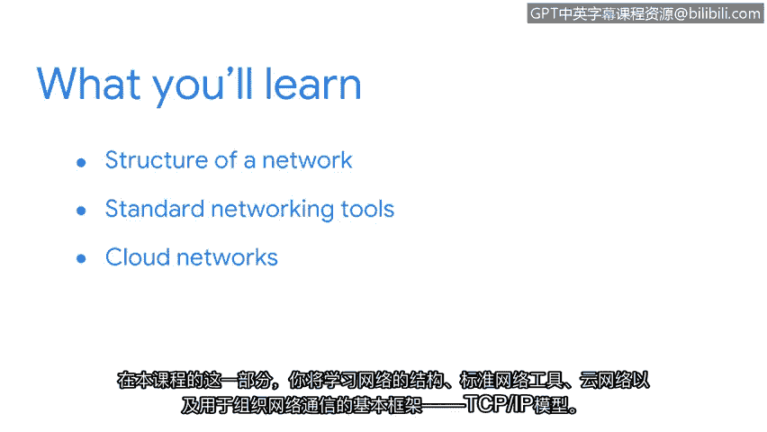

# 002：1_欢迎来到第一周

在本节课程中，我们将学习网络的基础知识。要保护一个网络，首先需要理解其基本设计与运作方式。我们将探讨网络的结构、标准网络工具、云网络，以及用于组织网络通信的基本框架——TCP/IP模型。

## 🏗️ 网络基础：结构与设计

上一段我们明确了学习目标，本节中我们来看看网络的基本结构。网络由相互连接的设备组成，这些设备通过有线或无线方式共享资源与信息。

以下是网络的核心组成部分：

*   **节点**：指网络中任何可以发送或接收数据的设备，例如计算机、服务器、打印机或路由器。
*   **链路**：连接节点的物理或逻辑通路，例如网线或无线信号。
*   **协议**：设备之间进行通信所必须遵循的一套规则和标准。

## 🔧 标准网络工具

理解了网络的基本构成后，我们需要认识一些用于管理和诊断网络的常见工具。这些工具帮助安全分析师监控网络状态并排查问题。

以下是几种基本的网络工具：

*   **Ping**：用于测试与另一台网络设备是否可连通。其基本命令格式为 `ping <目标IP地址或域名>`。
*   **Traceroute/Tracert**：用于显示数据包从源到目的地所经过的路径（所有中间节点）。
*   **Ipconfig/Ifconfig**：用于查看和配置网络接口的信息，如IP地址、子网掩码和默认网关。

## ☁️ 云网络简介

传统网络通常局限于物理位置，而现代网络越来越多地扩展到云端。云网络通过互联网提供可扩展的计算资源和服务。

云网络的主要特征包括：

*   **按需自助服务**：用户可以根据需要自动配置计算资源。
*   **广泛的网络访问**：资源可通过网络标准机制访问，支持各种客户端设备。
*   **资源池化**：供应商的计算资源被集中起来，通过多租户模型服务多个客户。

## 🌐 TCP/IP 模型：网络通信的框架

要组织复杂的网络通信，需要一个清晰的框架。TCP/IP模型是一个四层概念模型，定义了数据如何在网络中打包、寻址、传输和接收。

以下是TCP/IP模型的四个层次：

1.  **网络接入层**：负责在物理网络上传输数据帧，处理与硬件的直接交互。
2.  **互联网层**：使用IP协议将数据包从源主机路由到目标主机，核心是**IP地址**。
3.  **传输层**：确保数据的可靠传输，主要协议是**TCP（传输控制协议）** 和**UDP（用户数据报协议）**。
4.  **应用层**：为应用程序提供网络服务，例如HTTP用于网页浏览，SMTP用于电子邮件。

## 🛡️ 网络安全分析师的责任

网络的安全防护是安全分析师职责的重要组成部分。掌握网络基础知识是识别和防御威胁、风险与漏洞的第一步。接下来，我们将以此为基础，深入学习如何保护组织网络的安全。

---

**总结**：本节课中我们一起学习了网络的基础构成、常用的网络诊断工具、云网络的基本概念以及作为网络通信核心框架的TCP/IP模型。理解这些基础知识是后续学习网络安全防护技术的必要前提。