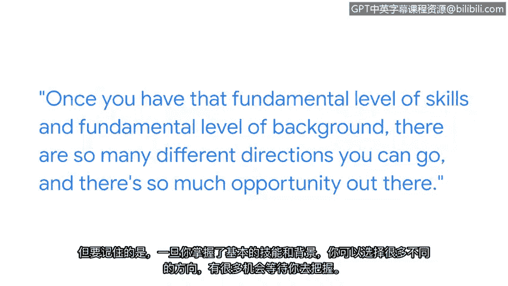

# 003：我在网络安全领域的道路

## 概述

在本节中，我们将跟随克里斯——谷歌旗下Fiveber公司的首席信息安全官，了解他进入网络安全领域的独特职业路径。我们将学习他的经验、面临的挑战以及他给初学者的宝贵建议。

## 自我介绍与职责

我的名字是克里斯，我是谷歌旗下Fiveber公司的首席信息安全官。我们为全美客户提供高速互联网服务。作为首席信息安全官，我的职责是确保网络安全、保护客户数据安全，并根据需要为执法部门及其他机构提供支持。

## 曲折的职业道路

我的职业道路漫长而曲折。我的第一份工作实际上是在家族杂货店当屠夫。我最终在大学计算机中心找到了一份工作，在那里我学到了许多最初的计算机技能。

大学毕业后，我最初是一名软件开发人员，为一家支持美国农业部的咨询公司设计会计软件。之后，我转换了其他角色，最终进入了一家早期的有线互联网公司。我负责运营他们的多项服务，如电子邮件、网络服务等。

## 踏入网络安全领域的契机

我负责的系统不断遭到攻击。我之所以进入网络安全领域，是因为我必须为自己构建的东西进行防御。我意识到这很有趣，也意识到这是一个绝佳的职业机会。因此，从那以后我就一直坚持在这个领域。

## 早期挑战与学习方式

当我进入这个领域时，除了几本书之外，没有太多的培训材料。有一些人可以让我提问并获得一些指导。但总的来说，我基本上是靠自己摸索。

## 人际关系的重要性

尽管这是一个技术性很强的领域，但你要学习的最重要的东西将是与他人的联系。我主动决定积极参与一些外部工作组织、行业协会、非营利组织、技术聚会和其他网络安全组织。这使我能够建立声誉和人际关系。因此，随着我的职业发展，人们开始主动联系我，询问我是否有兴趣参与新的机会。

## 给初学者的建议

因为网络安全行业非常多样化，看起来似乎有海量的知识需要学习，有巨大的台阶需要跨越才能进入这个行业，这可能会让人望而生畏。

但要记住的是，一旦你掌握了基础技能和背景知识，你就有很多不同的方向可以选择，并且有大量的机会在等着你。

## 持续学习与行业乐趣

这份工作具有持续教育和保持好奇心的特点，这非常有趣。这意味着你总是有机会学习新东西，改变方向，探索新的道路，因为网络安全领域将不断变化。而这正是乐趣的一部分。

## 总结

本节课中，我们一起学习了克里斯从非技术背景进入网络安全领域的历程。我们了解到，**掌握基础技能**是起点，**积极构建人际网络**至关重要，而面对行业的广度和快速变化，保持**持续学习的好奇心**是获得乐趣和成功的关键。网络安全领域充满机会，入门后有多样化的发展路径。