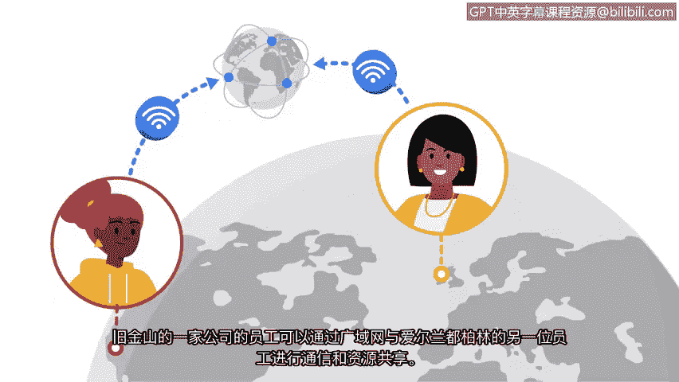

**网络安全基础：第三课：什么是网络**

在本节课中，我们将学习网络的基本概念，包括其定义、组成、通信方式以及两种主要类型。理解这些基础知识是后续学习网络安全的重要前提。

---

在了解保护网络的重要性之前，你需要先知道什么是网络。网络是一组相互连接的设备。

**网络的组成**
以下是网络中常见的设备示例：
*   在家庭环境中，连接到网络的设备可能包括你的笔记本电脑、手机以及智能设备，如冰箱或空调。
*   在办公室环境中，工作站、打印机和服务器等设备都连接到网络。

**网络通信**
网络上的设备可以通过网络电缆或无线连接相互通信。你家庭和办公室的网络也可以与其他地点的网络及其上的设备进行通信。

**设备寻址**
设备需要在网络上找到彼此才能建立通信。这些设备使用唯一的地址或标识符来定位对方。这些地址确保通信发生在正确的设备之间。这些地址被称为 **IP地址** 和 **MAC地址**。

**网络类型**
设备可以在两种类型的网络上进行通信：局域网和广域网。

*   **局域网**：局域网覆盖一个小范围区域，例如办公楼、学校或家庭。例如，当你的手机或平板电脑连接到家里的Wi-Fi时，它们就形成了一个局域网。这个局域网随后连接到互联网。
*   **广域网**：广域网覆盖一个大的地理区域，例如一个城市、州或国家。你可以将互联网视为一个巨大的广域网。例如，旧金山一家公司的员工可以通过广域网与爱尔兰都柏林的另一名员工进行通信和共享资源。

---

上一节我们介绍了网络的基本类型，现在让我们来总结一下。本节课中，我们一起学习了网络的定义、常见设备、通信方式、设备寻址（IP地址和MAC地址）以及两种主要网络类型：局域网和广域网。

在接下来的视频中，我们将学习连接到这些网络的设备。