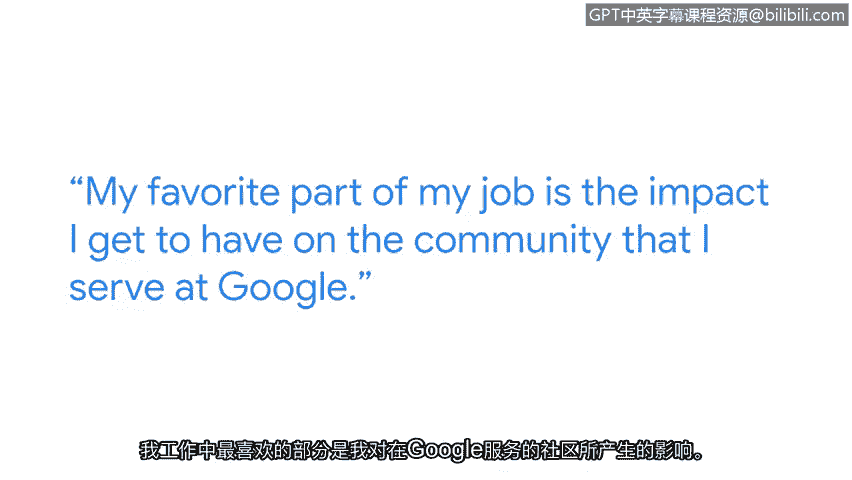

# 005：蒂娜的网络安全工作分享

## 概述
在本节课程中，我们将跟随谷歌软件工程师蒂娜，了解她在网络安全领域的日常工作内容、面临的挑战以及她对初学者的建议。通过她的分享，我们可以一窥网络安全工作的实际面貌。

## 蒂娜的自我介绍
我的名字是蒂娜，我是谷歌的一名软件工程师。

作为一名软件工程师，我负责开发一个服务于谷歌内部安全工程师和网络工程师的内部工具。

## 网络安全的重要性
网络安全至关重要，因为我们需要确保我们的网络系统安全且具有韧性，能够抵御恶意黑客的攻击，并且有能力保护我们的用户数据。

## 工作的核心内容与价值
从事网络安全工作，使我有机会看到整个公司网络系统的全貌，这非常酷。

我工作中最喜欢的部分，是我能对我所服务的谷歌内部社区产生实际影响。

## 典型的工作日
可以说，我大部分时间都在进行大量的编码、设计工作，与安全团队和网络团队沟通他们的工作重点和遇到的障碍，并共同制定解决方案。

## 处理团队需求与挑战
来自网络团队和安全团队的请求时常出现，这些请求通常对特定平台或某项网络策略中的功能有具体要求。

通常，我们会优先处理这些请求，并努力制定修复方案。

## 给初学者的建议
对于想要踏上网络安全旅程的人，我的一条建议是：始终保持学习，并对事物的工作原理保持好奇心。

因为安全是一个不断变化的领域。

## 网络安全是团队协作
网络安全绝对是一个团队合作的领域。

每个人都能做出贡献，尤其是在网络安全问题上，一个问题可能存在多种可能性和不同的解决方案。

能够与他人一起头脑风暴、共同追踪问题总是很棒，因为有时事情会变得非常复杂，但共同协作解决问题的过程也充满乐趣。

## 总结
本节课中，我们一起学习了谷歌软件工程师蒂娜的日常工作，了解了网络安全工作的实际应用、其重要性以及团队协作的核心价值。蒂娜的建议强调了持续学习和保持好奇心在这一快速变化领域中的关键作用。