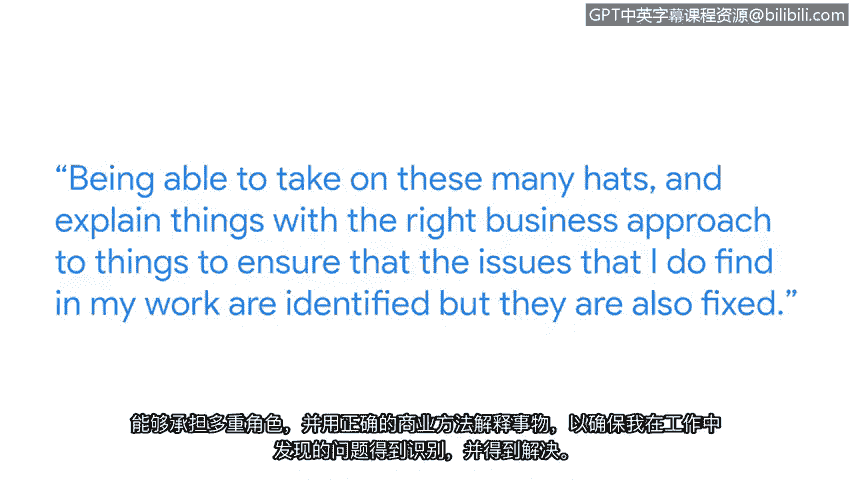

# 006：网络安全的有用技能 🔧

在本节课中，我们将跟随谷歌的进攻性安全工程师艾曼纽尔，了解网络安全领域所需的核心技能。我们将探讨从基础技术操作到高级沟通技巧的一系列能力，这些是构建成功网络安全职业生涯的基石。

## 技术技能基础 💻

上一节我们了解了网络安全的基本概念，本节中我们来看看从业者日常使用的具体技术技能。对于初级网络安全职位而言，日常工作通常涉及命令行操作、日志解析和网络流量分析。

以下是初级网络安全人员常用的三项核心技术：

*   **命令行操作**：命令行允许你与操作系统的各个层级进行交互。无论是像内存和内核这样的底层组件，还是像你在计算机上编写的应用程序和程序这样的高层级内容，命令行都是关键工具。例如，在Linux系统中，你可以使用 `ls` 命令列出目录内容，或使用 `grep` 命令搜索文件中的特定模式。
*   **日志解析**：在调试程序或应用程序出现的问题时，日志文件是定位根本原因并解决问题的关键支持。你需要学会从海量日志数据中提取有价值的信息。
*   **网络流量分析**：这项技能帮助你诊断网络问题，例如网速缓慢或流量未能路由到正确目的地。通过分析跨越不同应用层和网络层的流量，你可以确保网络正常运行，并识别其中的安全漏洞和风险。

## 安全视角下的技能应用 🛡️

掌握了基础技能后，我们需要从安全专业人员的视角来应用它们。在网络安全背景下，这些技能被用于特定的防护目的。

*   通过**网络流量分析**，安全人员可以检查网络中传输的数据，确保密码等敏感信息没有泄露。
*   这项技能也用于验证我们的基础设施是否安全，防火墙配置是否正确且安全。

## 超越技术的核心能力：有效沟通 🗣️

技术技能固然重要，但成功的网络安全专家还需要另一项关键能力。在我的当前角色中，一项持续增长的核心技能是**向产品团队和工程师进行有效沟通**。

这包括识别一个影响业务的问题，并有效地与相关团队沟通以修复它。这意味着需要具备多方面的能力，并用恰当的业务视角来解释问题，以确保我在工作中发现的问题不仅被识别，更能得到解决。

## 给学习者的建议与总结 🎯

回顾本节课，我们一起学习了网络安全领域从技术操作到业务沟通的系列技能。对于正在学习此证书课程的朋友，我的建议是：**拆解事物、适应不适、学习成长**。

主动寻找机会去学习和理解事物的工作原理，这套方法论将在你整个职业生涯中使你受益。

**总结**：本节课中，我们探讨了网络安全从业者所需的关键技能，包括命令行、日志解析、网络分析等硬技能，以及向非技术团队有效沟通和解决问题的软技能。保持好奇心，勇于实践，是在这个领域不断进步的关键。