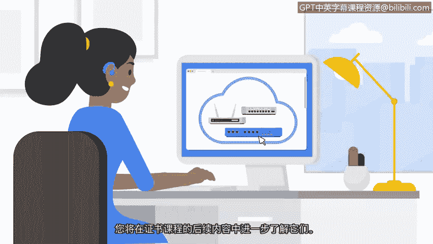

**谷歌网络安全专业证书第三课：连接与保护：网络与网络安全：P7：网络工具**

在本节课程中，我们将学习构成网络的一些常见设备。我们将了解集线器、交换机、路由器和调制解调器各自的功能与区别，并简要介绍虚拟化工具如何替代部分物理设备的功能。

网络由多种设备连接而成，每种设备在网络通信中扮演着特定的角色。以下是几种核心网络设备的介绍。

**集线器**

集线器是一种向网络中所有设备广播信息的网络设备。

可以将集线器想象成一个广播塔，它向所有调至正确频率的收音机广播信号。

**交换机**

交换机是一种更智能的网络设备，它通过在特定设备之间发送和接收数据来建立连接。

与集线器不同，交换机只将数据传递给预期的目标设备。

这使得交换机比集线器更安全，并能控制流量、提升网络性能。

上一节我们介绍了用于局域网内部连接的设备，本节中我们来看看连接不同网络的设备。

**路由器**

路由器是一种将多个网络连接在一起的网络设备。

例如，如果一个网络中的计算机想向另一个网络中的平板电脑发送信息，其传输过程如下：

1.  信息从计算机发送到路由器。
2.  路由器读取目标地址，并将数据转发给目标网络的路由器。
3.  接收方的路由器最终将信息引导至平板电脑。

最后，我们来了解连接本地网络与互联网的关键设备。

**调制解调器**

调制解调器是将你的路由器连接到互联网，并提供互联网接入的设备。

例如，如果一个网络中的计算机想向位于不同地理位置的另一个网络中的设备发送信息，其传输过程如下：

1.  计算机将信息发送给路由器。
2.  路由器通过调制解调器将信息传输到互联网。
3.  接收方的调制解调器收到信息，并将其传输给路由器。
4.  接收方的路由器最终将该信息转发给目标设备。

以上介绍的集线器、交换机、路由器和调制解调器都是物理设备。然而，这些物理设备执行的许多功能可以通过虚拟化工具来完成。

**虚拟化工具**

虚拟化工具是执行网络操作的软件。

它们可以完成通常由集线器、交换机、路由器或调制解调器执行的操作，并由云服务提供商提供。这些工具为节约成本和扩展性提供了可能，你将在证书课程的后续部分了解更多相关内容。

本节课中，我们一起学习了构成网络的几种核心物理设备：广播信号的**集线器**、智能连接设备的**交换机**、连接不同网络的**路由器**，以及接入互联网的**调制解调器**。我们还了解到，这些功能也可以通过云服务提供商提供的**虚拟化工具**以软件形式实现。接下来，你将进一步学习云计算，以及如何利用云服务来设计网络。