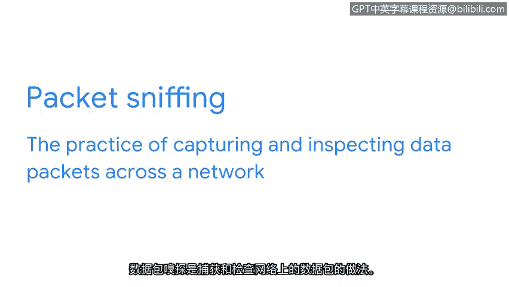

# 009：网络通信简介

在本节课中，我们将要学习网络通信的基本概念，包括数据包的结构、网络性能的衡量指标以及网络安全人员为何需要关注这些信息。

## 网络通信概述

网络帮助组织进行沟通和连接。但通信也使得网络攻击更有可能发生，因为它为恶意行为者提供了利用易受攻击设备和未受保护网络的机会。

网络通信发生在数据从一个点传输到另一个点时。这些数据片段通常被称为数据包。

## 数据包详解

上一节我们介绍了网络通信的基本概念，本节中我们来看看数据包的具体构成。

一个数据包是在网络内从一个设备传输到另一个设备的基本信息单元。当数据通过网络从一个设备发送到另一个设备时，它是以数据包的形式发送的。这个数据包包含了关于它要去往何处、来自何处以及消息内容的信息。

可以将数据包想象成一封实体邮件。假设你想给朋友寄一封信。信封上需要有收信人的地址和你的回信地址。信封内是包含你想让朋友阅读的信息的信件。

数据包与实体信件非常相似，它包含一个头部。以下是数据包头部包含的关键信息：

*   **目的设备的IP地址**：即互联网协议地址。
*   **目的设备的MAC地址**：即媒体访问控制地址。
*   **协议编号**：告知接收设备如何处理数据包中的信息。

接着是数据包的主体部分，它包含了需要传输给接收设备的消息。

最后，在数据包的末尾有一个尾部。类似于信件上的签名，尾部向接收设备发出信号，表明数据包已传输完毕。

## 网络性能与安全

了解了数据包的结构后，我们来看看数据包的传输如何反映网络状态。

数据包在网络中的移动情况可以反映网络的性能表现。网络性能可以通过带宽来衡量。带宽指的是设备每秒接收的数据量。你可以通过以下公式计算带宽：

**带宽 = 数据量 / 时间（秒）**

速度指的是数据包被接收或下载的速率。安全人员对网络带宽和速度感兴趣，因为如果其中任何一项出现异常，都可能表明存在攻击。

## 数据包嗅探

网络上的通信对于共享资源和数据很重要，因为它使组织能够有效运作。接下来，你将了解更多支持网络通信的协议。

数据包嗅探是捕获和检查网络上数据包的实践。这项技术既可用于网络故障排除，也可能被攻击者用于窃听网络流量。

## 课程总结

本节课中我们一起学习了网络通信的基础知识。我们了解了数据包如同网络中的“信件”，包含头部、主体和尾部。我们还探讨了如何通过带宽和速度衡量网络性能，并认识到这些指标的异常可能是网络攻击的迹象。最后，我们简要介绍了数据包嗅探的概念。理解这些基本原理是深入学习网络协议和安全防护的重要第一步。