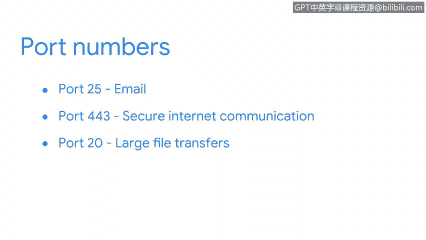
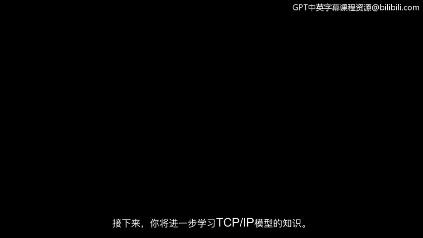

# 010：TCP/IP模型

在本节课程中，我们将学习设备在互联网上相互通信所使用的核心协议——TCP/IP模型。我们将分别探讨TCP和IP的定义、功能，并了解端口在网络通信中的关键作用。

## 什么是TCP/IP模型？🌐

TCP/IP模型是用于网络通信的标准模型。TCP/IP代表**传输控制协议**和**互联网协议**。

## 深入理解TCP与IP

上一节我们介绍了TCP/IP模型的基本概念，本节中我们来看看TCP和IP各自的具体功能。

首先，**TCP**，即传输控制协议，是一种互联网通信协议。它允许两台设备建立连接并传输数据流。该协议包含一套组织数据的指令，以便数据能在网络中发送。它还在两台设备之间建立连接，并确保数据包到达正确的目的地。

**IP**，即互联网协议，是用于在网络设备之间路由和寻址数据包的一套标准。互联网协议中包含**IP地址**，它充当每个私有网络的地址。我们将在稍后更详细地学习IP地址。

## 端口：网络通信的“门牌号”🚪

当数据包在网络中发送和接收时，它们会被分配到端口。在联网设备的操作系统中，**端口**是一个基于软件的位置，用于组织网络设备之间的数据发送和接收。

端口根据将在两台设备之间执行的服务，将网络流量划分为不同的段。发送和接收这些数据段的计算机知道如何根据其端口号来优先处理和处理这些段。

这就像给住在公寓楼里的朋友寄信。邮递员不仅知道如何找到大楼，还确切知道在大楼里该去哪里找到你朋友居住的公寓号。

以下是端口工作的关键点：

*   数据包包含告诉接收设备如何处理信息的指令，这些指令以端口号的形式存在。
*   端口号允许计算机分割网络流量，并优先处理它们将对数据执行的操作。

一些常见的端口号示例如下：

*   **端口 25**：用于电子邮件。
*   **端口 443**：用于安全的互联网通信。
*   **端口 20**：用于大文件传输。

## 课程总结

在本节课中，我们一起学习了TCP/IP模型的基础知识。我们了解到，TCP负责建立可靠的连接并确保数据传输，而IP则负责数据的路由和寻址。此外，我们还探讨了端口如何像“门牌号”一样，帮助设备组织和优先处理不同类型的网络流量。正如视频所示，数据包在网络中传输时包含了大量的信息和指令。在接下来的课程中，我们将继续深入学习TCP/IP模型的其他方面。

