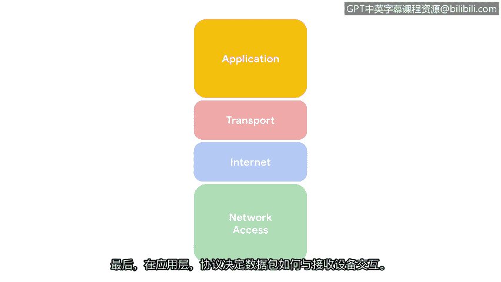

# 011：TCP/IP模型的四层 🧱

在本节课程中，我们将学习TCP/IP模型。这是一个用于理解和组织网络数据如何传输的框架。了解这个模型有助于安全专业人员识别和防范网络中的潜在问题。

我们已经讨论了网络的结构以及通信如何进行。现在，了解安全专业人员如何识别可能出现的问题非常重要。

TCP/IP模型是一个用于可视化数据如何在网络中组织和传输的框架。

TCP/IP模型有四层。这四层分别是：网络接入层、网际层、传输层和应用层。

了解TCP/IP模型如何组织网络活动，使安全专业人员能够监控并防范风险。

让我们逐一审视这些层。

**第一层是网络接入层。**

网络接入层处理数据包的创建及其在网络中的传输。这包括连接到物理电缆的硬件设备，以及将数据引导至目的地的交换机。

**第二层是网际层。**

网际层是将IP地址附加到数据包上，以指示发送方和接收方位置的层级。网际层也关注网络之间如何相互连接。例如，数据包包含的信息决定了它们是留在局域网内，还是被发送到像互联网这样的远程网络。

**第三层是传输层。**

传输层包含控制网络流量传输的协议。这些协议允许或拒绝与其他设备的通信，并包含有关连接状态的信息。该层的活动包括**错误控制**，以确保数据在网络中顺畅流动。

**第四层是应用层。**

最后，在应用层，协议决定了数据包将如何与接收设备交互。在应用层组织的功能包括文件传输和电子邮件服务。

现在，你已经了解了TCP/IP模型及其四层。我们下一个视频再见。