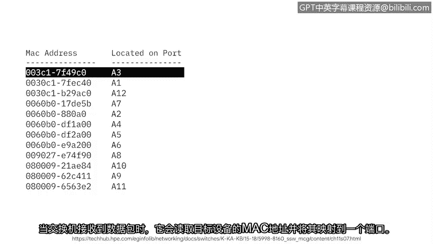

# 012：IP地址与网络通信

在本节课程中，我们将学习IP地址如何用于网络通信。我们将了解IP地址的类型、作用，以及它与MAC地址的区别。

## 什么是IP地址？🌐

IP代表互联网协议。互联网协议地址，简称IP地址，是一个唯一的字符串，用于标识互联网上设备的位置。

互联网上的每个设备都有一个唯一的IP地址，就像街道上的每栋房子都有自己的邮寄地址一样。

## IP地址的类型：IPv4与IPv6

IP地址主要有两种类型：IP版本4和IP版本6。

**IPv4地址**由4组1到3位的数字组成，每组数字之间用小数点分隔。例如：
`192.168.1.1`

在互联网早期，所有地址都是IPv4格式。但随着互联网的普及，IPv4地址开始被耗尽，因此开发了IPv6。

**IPv6地址**由32个字符组成。其更长的地址长度允许连接更多的设备到互联网，避免了像IPv4那样快速耗尽地址的问题。例如：
`2001:0db8:85a3:0000:0000:8a2e:0370:7334`

## 公共IP地址与私有IP地址

IP地址可以是公共的，也可以是私有的。

您的互联网服务提供商会根据您的地理位置，为您分配一个**公共IP地址**。当您的设备在互联网上进行网络通信时，所有发出的通信都使用这个相同的对外公共地址。

这就像一所房子里的所有室友共享同一个邮寄地址一样，同一个网络上的所有设备也共享同一个对外公共IP地址。

**私有IP地址**则只能被同一本地网络上的其他设备看到。这意味着您家庭网络上的所有设备都使用唯一的IP地址相互通信，而这些地址是互联网上的其他部分无法看到的。

## MAC地址：设备的物理标识🔧

网络通信中使用的另一种地址称为**MAC地址**。

MAC地址是一个唯一的字母数字标识符，分配给网络上的每个物理设备。当交换机收到一个数据包时，它会读取目标设备的MAC地址，并将其映射到一个端口。

然后，交换机会将这些信息保存在一个**MAC地址表**中。

您可以将MAC地址表想象成一个地址簿，交换机用它来将数据包引导到正确的设备。

## 总结📝

在本节课程中，我们一起学习了：
*   IP地址是互联网上设备的唯一标识符。
*   IP地址的两种主要类型：IPv4和IPv6。
*   公共IP地址与私有IP地址的区别。
*   MAC地址是网络设备的物理硬件标识，由交换机用于在本地网络内精确路由数据。

通过理解IP地址和MAC地址，您就掌握了网络设备如何相互定位和通信的基础知识。

