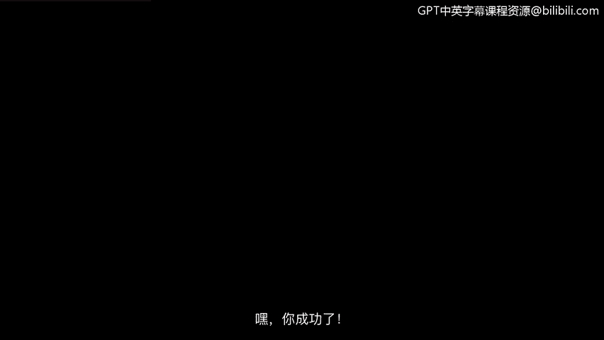
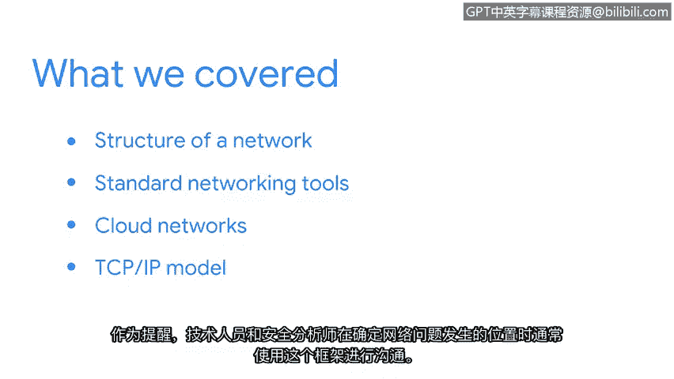

# 013：12_总结

在本节课程中，我们一起学习了网络的基础结构、关键设备以及用于分析和描述网络通信的模型。接下来，我们将对本节内容进行回顾与总结。

我们探讨了网络的结构，包括**广域网**和**局域网**。

我们也讨论了标准的网络设备，例如**集线器**、**交换机**、**路由器**和**调制解调器**。

我们简要介绍了**云网络**，并讨论了它的优势。

我们还花了一些时间来学习**TCP/IP模型**。需要记住的是，技术人员和安全分析师在沟通网络故障发生在何处时，经常使用这个框架。

本节内容到此结束。在接下来的学习中，你将了解更多关于网络操作以及数据如何在无线网络中传输的知识。