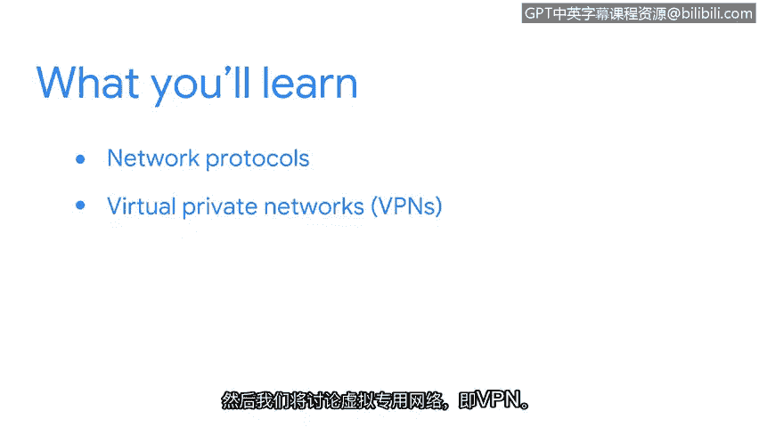

**网络安全基础：第三课：连接与保护：网络与网络安全**

**概述**

在本节课程中，我们将学习网络如何通过工具和协议进行运作。这些是您作为安全分析师在日常工作中会频繁使用的核心概念。本部分介绍的工具和协议将帮助您保护组织网络免受攻击。

您是否知道，恶意行为者可以利用网络中设备间传输的数据？幸运的是，存在相应的工具和协议来确保网络免受此类威胁。例如，我曾仅凭攻击者使用了错误的协议就识别出了一次攻击。当时的网络流量大小正常，来源也是可信的IP地址，但因其使用了错误的协议，这足以引起我们的警觉，从而在攻击造成实际损害之前将其阻止。

接下来，我们将首先讨论一些常见的网络协议。然后，我们将探讨虚拟专用网络（VPN）。最后，我们将学习防火墙、安全区域和代理服务器。

现在您已经了解了本节的学习方向，让我们开始吧。

---

**网络协议**

上一节我们概述了本节内容，现在让我们深入了解网络通信的基础——网络协议。网络协议是设备之间进行通信和数据交换时遵循的一套既定规则和标准。它们确保了不同设备和系统能够相互理解。

以下是几种关键的网络协议：

*   **传输控制协议 (TCP)**：这是一种面向连接的协议，确保数据可靠、有序地从源设备传输到目标设备。它通过三次握手建立连接，并在传输过程中进行错误检查和数据包重传。代码示例：`TCP连接建立：SYN -> SYN-ACK -> ACK`
*   **用户数据报协议 (UDP)**：与TCP相反，UDP是一种无连接的协议。它传输速度更快，但不保证数据包的顺序或可靠性。它适用于实时应用，如视频流或在线游戏，其中速度比绝对精确更重要。公式表示其特点：`速度 > 可靠性`
*   **互联网协议 (IP)**：IP协议负责将数据包从源地址路由到目标地址。它使用IP地址（如 `192.168.1.1`）来唯一标识网络上的每个设备，是互联网通信的基础。
*   **超文本传输协议 (HTTP/HTTPS)**：HTTP是用于传输网页数据的协议。HTTPS是其安全版本，通过**SSL/TLS加密**来保护数据传输的安全，防止窃听和篡改。

---

**虚拟专用网络 (VPN)**

了解了基础协议后，我们来看一个重要的网络安全工具——虚拟专用网络。VPN通过在公共网络（如互联网）上创建一个加密的“隧道”，来扩展一个私有网络。这使得远程用户能够安全地访问公司内部网络资源，就像他们直接连接在内部网络上一样。

VPN的核心价值在于：
*   **数据加密**：保护传输中的数据不被窥探。
*   **身份验证**：确保只有授权用户才能连接。
*   **安全远程访问**：为员工提供从任何地点安全办公的能力。

---

**防火墙、安全区域与代理服务器**

在讨论了远程访问安全之后，我们将焦点转向网络边界和内部的核心防护措施。这些是构建纵深防御策略的关键组件。

**防火墙**
防火墙是一种网络安全系统，它根据预定义的安全规则监控并控制进出网络的数据流量。它就像网络的门卫，决定允许或阻止哪些数据包。基本规则可以用逻辑表示：`IF (数据包符合安全规则) THEN 允许 ELSE 阻止`

**安全区域**
为了更精细地管理安全策略，网络通常被划分为不同的安全区域（例如，内部信任区、外部非军事区、互联网非信任区）。防火墙在不同区域之间实施访问控制策略。

**代理服务器**
代理服务器充当客户端（如用户浏览器）和目标服务器之间的中介。它可以用于：
*   **内容过滤**：阻止访问恶意或不适当的网站。
*   **匿名与隐私**：隐藏客户端的真实IP地址。
*   **缓存**：存储常用内容以加快访问速度并节省带宽。

---

**总结**

本节课中，我们一起学习了网络运作的关键工具与协议。我们从确保可靠通信的**TCP**和**UDP**协议开始，然后探讨了实现安全远程连接的**VPN**技术。最后，我们深入了解了保护网络边界的**防火墙**、用于分区管理的**安全区域**以及作为流量中介的**代理服务器**。这些概念和工具共同构成了网络安全防御的基础，是安全分析师识别、分析和应对网络威胁的必备知识。掌握它们，您将能更有效地守护组织网络的安全。