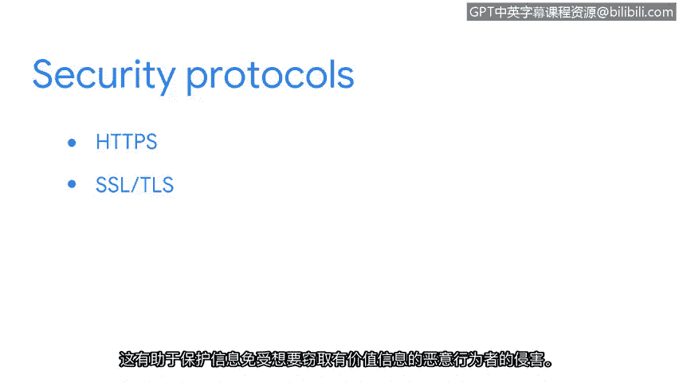

# 015：14_网络协议

在本节课中，我们将要学习网络协议。网络协议是网络通信的规则，它们确保数据能够被正确发送和接收。我们将通过一个访问网站的简单例子，来了解几种常见的网络协议是如何协同工作的。

## 网络协议概述

网络得益于规则的制定。规则确保通过网络发送的数据能够到达正确的位置。这些规则被称为**网络协议**。网络协议是一组由网络上的两个或多个设备使用的规则，用于描述数据的传输顺序和结构。

## 协议协同工作示例

为了理解不同类型的网络协议如何协同工作，我们来看一个具体的场景：访问一个食谱网站。

假设你想访问你最喜欢的食谱网站。你在浏览器顶部的地址栏中输入网站的地址，例如 `www.yummyrecipesforme.org`。

### 建立连接：TCP协议

在你访问网站之前，你的设备需要与网络服务器建立通信。这种通信使用一种称为**传输控制协议**的协议。

**TCP** 是一种互联网通信协议，它允许两个设备建立连接并传输数据流。TCP 在允许任何进一步通信之前，还会验证双方设备。这个过程通常被称为 **“三次握手”**。

一旦通过 TCP 握手建立了通信，就会向网络发出请求。在我们的例子中，我们向 `yummyrecipesforme` 服务器请求了数据。

### 寻址与转发：ARP协议

服务器将响应该请求，并将数据包发送回你的设备，以便你可以查看网页。当数据包在网络中移动时，它们会在路由器等网络设备之间传递。

**地址解析协议** 用于确定路径中下一个路由器或设备的 MAC 地址。这确保了数据能够到达正确的位置。

### 安全通信：HTTPS协议

现在通信已经建立，目标设备也已确定，是时候访问 `yummyrecipesforme` 网站了。**超文本传输安全协议** 是一种网络协议，它提供了客户端和网站服务器之间的安全通信方法。

它允许你的网络浏览器安全地向 `yummyrecipesforme` 服务器发送网页请求，并接收网页作为响应。

### 域名解析：DNS协议

接下来是**域名系统**协议，它是一种将互联网域名转换为 IP 地址的网络协议。

DNS 协议将网址中的域名发送到 DNS 服务器，该服务器会检索你试图访问的网站的 IP 地址（在本例中是 `yummyrecipesforme`）。这个 IP 地址将作为数据包前往 `yummyrecipesforme` 网络服务器的目标地址。

## 协议与安全的关系

那么，这些协议与安全有什么关系呢？在 `yummyrecipesforme` 网站的例子中，我们使用了 HTTPS，这是一种从网络服务器请求网页的安全协议。

HTTPS 使用**安全套接字层**和**传输层安全**来加密数据，这有助于保护信息，防止恶意攻击者窃取有价值的数据。

## 总结

本节课中我们一起学习了网络协议。仅仅访问一个网站，你网络上的设备就使用了四种不同的协议：TCP、ARP、HTTPS 和 DNS。这些只是网络通信中使用的部分协议。在你的安全分析师职业生涯中，你会越来越熟悉网络协议，并在日常活动中使用它们。

