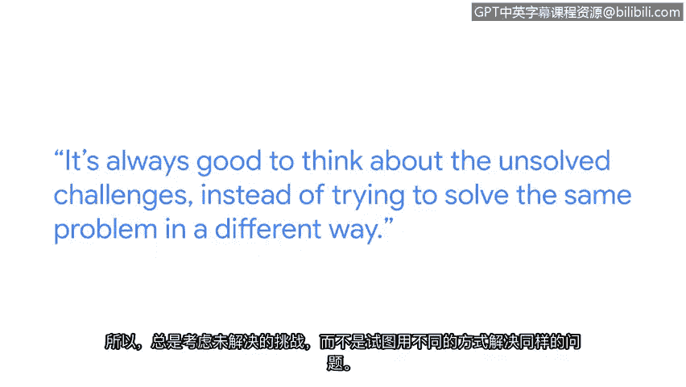

**谷歌网络安全专业证书第三课：连接与保护：网络与网络安全 - P16：网络安全工程师的一天与行业洞见**

在本节课程中，我们将跟随谷歌企业基础设施保护团队的工程师安塔拉，了解网络安全工程师的日常工作内容、解决问题的思路，以及她为初学者提供的宝贵行业建议。

---

我的名字是安塔拉。我在谷歌的企业基础设施保护团队工作。我们的主要职责是保护所有出色的谷歌产品所运行的基础设施。

我并非计算机科班出身。我的本科专业是电子与通信，这与计算机领域相去甚远。我接受了挑战，在第一份工作中转向了计算机领域，这让我更深入地探索了安全世界。因此，我攻读了安全领域的硕士学位，获得了该领域的专业知识，然后以安全工程师的身份加入了谷歌。

上一节我们了解了网络安全工程师的背景，本节中我们来看看他们典型的一天是如何度过的。

一位初级网络安全工程师典型的一天通常从解决问题开始。例如，你可能需要调试为什么某个特定端点充斥着大量流量，或者为什么这个端点速度变慢。你会从基础步骤入手：连接到该端点，捕获一些流量，查看通过该端点流入和流出的流量类型。

在分析过程中，有时换个角度思考会有新发现。午餐时回顾问题，可能会突然想到之前未考虑的视角。你可能会尝试进行实验室复现：连接这些端点，尝试重现问题。在复现过程中，你可能会观察到一些之前未曾想到的情况。

这时，你可能需要咨询不同领域的专家，他们可能更了解相关领域。向他们展示你的所有分析和操作，他们的观点可能直接帮助你找到解决方案。仅仅通过与人交流，就可能获得答案。

这种工作就像一直在解谜，非常有趣且令人兴奋。

在介绍了日常工作模式后，以下是安塔拉总结的一些网络安全最佳实践建议。

一些我学到的网络安全最佳实践包括：不要总是试图重新发明轮子。有些协议和算法已经过反复测试、分析，并被认定在网络安全中使用是安全的。你花在重复造轮子上的时间，并不会带来你所需的收益。因此，始终专注于思考那些尚未解决的挑战，比用不同方式解决同一个问题更有价值。

最后，安塔拉分享了她对网络安全行业前景的看法。

我认为网络安全是目前一个非常值得进入的领域。正如我们所看到的，我们正处于信息时代，技术正在呈指数级增长。进入这个领域本身就令人兴奋，因为该领域不断涌现出惊人的新挑战。

---

本节课中，我们一起学习了网络安全工程师安塔拉的工作日常、她解决问题的典型思路（从抓包分析到实验室复现与专家协作），以及两条核心建议：**利用成熟方案而非重复造轮子**，以及**专注于解决新挑战**。她还指出，网络安全是一个随着技术发展而不断产生新机遇的激动人心的领域。