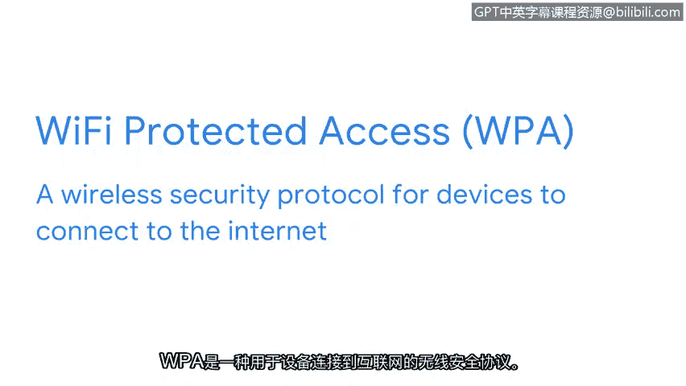

# 017：无线协议

## 概述
在本节课中，我们将深入学习一类被称为 IEEE 802.11 的通信协议，即我们通常所说的 Wi-Fi。我们将探讨其发展历程、安全协议（如 WPA、WPA2、WPA3）的演变，并了解作为安全分析师应如何确保组织内无线连接的安全性。

---

## IEEE 802.11 协议简介
到目前为止，我们已经学习了多种网络协议，包括像 TCP/IP 这样的通信协议。现在，我们将更深入地探讨一类名为 IEEE 802.11 的通信协议。

IEEE 802.11，通常被称为 Wi-Fi，是一套定义无线局域网通信的标准。IEEE 代表电气与电子工程师学会，这是一个维护 Wi-Fi 标准的组织。而 802.11 是用于无线通信的一套协议。

---

## Wi-Fi 安全协议的演变
Wi-Fi 协议多年来不断演进，旨在变得更安全、更可靠，以提供与有线连接同等级别的安全性。

在 2004 年，一种名为 **Wi-Fi 保护访问** 的安全协议被引入。**WPA** 是一种允许设备安全连接到互联网的无线安全协议。自那时起，WPA 已演变为更新的版本，如 **WPA2** 和 **WPA3**。这些新版本包含了进一步的安全改进，例如更先进的加密技术。

以下是 WPA 协议家族的主要版本：
*   **WPA**：初始的 Wi-Fi 保护访问协议。
*   **WPA2**：引入了更强大的加密标准（如 AES）。
*   **WPA3**：提供了进一步增强的安全性，例如对公共网络更强大的保护。

---

## 安全分析师的责任
作为安全分析师，您可能需要负责确保组织内的无线连接是安全的。

让我们进一步了解相关的安全措施。

---

## 总结
本节课中，我们一起学习了 IEEE 802.11（Wi-Fi）协议的基本概念，回顾了从 WPA 到 WPA3 的安全协议发展历程，并明确了安全分析师在维护无线网络安全方面的重要职责。理解这些协议及其安全特性是构建安全网络环境的基础。