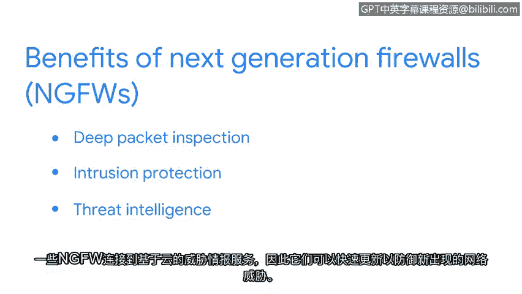

# 018：防火墙和网络安全措施 🔥

在本节课中，我们将要学习防火墙的基本概念、不同类型及其工作原理。防火墙是网络安全的第一道防线，它通过监控和控制网络流量来保护内部网络免受外部威胁。我们将探讨硬件、软件和云防火墙的区别，并深入了解无状态与有状态防火墙的运作方式。

---

## 什么是防火墙？

防火墙是一种网络安全设备，它监控进出您网络的流量。它根据一组已定义的安全规则，允许或阻止流量通过。

防火墙可以使用**端口过滤**功能，通过阻止或允许特定的端口号来限制不必要的通信。例如，可以设置一条规则，只允许通过端口443（用于HTTPS）或端口25（用于电子邮件）的通信，并阻止所有其他端口。这些防火墙设置由组织的安全策略决定。

---

## 防火墙的类型

上一节我们介绍了防火墙的基本定义，本节中我们来看看几种不同类型的防火墙。

### 硬件防火墙
硬件防火墙被认为是防御网络威胁的最基本方式。硬件防火墙在允许每个数据包进入网络之前，会对其进行检查。

### 软件防火墙
软件防火墙执行与硬件防火墙相同的功能，但它不是一个物理设备。相反，它是一个安装在计算机或服务器上的软件程序。
*   如果软件防火墙安装在计算机上，它将分析该计算机接收的所有流量。
*   如果软件防火墙安装在服务器上，它将保护连接到该服务器的所有设备。

软件防火墙的成本通常低于购买单独的物理设备，并且不占用额外空间。但由于它是一个软件程序，会给单个设备增加一些处理负担。

### 云防火墙
组织可以选择使用基于云的防火墙。云服务提供商为组织提供防火墙即服务（FaaS）。云防火墙是由云服务提供商托管的软件防火墙。

组织可以在云服务提供商的界面上配置防火墙规则。在流量到达组织的现场网络之前，防火墙将对所有传入流量执行安全操作。云防火墙还能保护组织可能在云中使用的任何资产或流程。

---

## 无状态与有状态防火墙

我们讨论了不同类型的防火墙，接下来需要理解它们如何运作。术语“有状态”和“无状态”指的是防火墙的操作方式。

### 有状态防火墙
“有状态”指的是一类能够跟踪通过它的信息并主动过滤威胁的防火墙。有状态防火墙会分析网络流量的特征和行为，发现可疑迹象并阻止其进入网络。

### 无状态防火墙
“无状态”指的是一类基于预定义规则运行，且不跟踪数据包信息的防火墙。无状态防火墙仅根据防火墙管理员预设的规则行事。防火墙管理员编程的规则告诉设备接受什么和拒绝什么。

无状态防火墙不存储或分析信息，也不会像有状态防火墙那样发现可疑趋势。因此，无状态防火墙被认为不如有状态防火墙安全。

---

## 下一代防火墙

在了解了传统防火墙之后，我们来看看更先进的解决方案。下一代防火墙（NGFW）提供比有状态防火墙更高的安全性。

NGFW不仅对有状态防火墙的传入和传出流量进行状态检查，还执行更深入的安全功能，如**深度数据包检查**和**入侵防护**。一些NGFW连接到基于云的威胁情报服务，因此它们可以快速更新，以防范新出现的网络威胁。

---

## 总结

本节课中我们一起学习了防火墙的基础知识及其工作原理。我们了解到防火墙可以是硬件或软件形式，并讨论了无状态防火墙与有状态防火墙的区别以及有状态防火墙的安全优势。最后，我们探讨了下一代防火墙及其提供的额外安全功能。防火墙是构建安全网络环境的核心组件，理解其类型和运作机制对于网络安全至关重要。