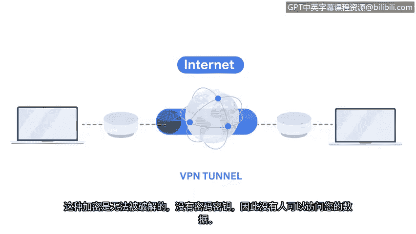

**网络安全基础：第三课：虚拟私有网络（VPN）**

在本节课中，我们将学习虚拟私有网络（VPN）如何为您的网络连接增添安全性。VPN是一种重要的网络安全服务，它通过加密和隐藏您的网络活动来保护您的隐私和数据。

当您连接到互联网时，您的互联网服务提供商会接收您网络的请求，并将其转发到正确的目标服务器。然而，您的互联网请求包含了您的私人信息。这意味着如果网络流量被截获，他人可能将您的网络活动与您的物理位置和个人信息关联起来。这些信息可能包括您希望保密的银行账户和信用卡号等。

**什么是VPN？**

虚拟私有网络，简称VPN，是一种网络安全服务。它能改变您的公共IP地址并隐藏您的虚拟位置，从而确保您在使用公共网络（如互联网）时数据保持私密。VPN还会在您的数据穿越互联网时对其进行加密，以保障机密性。

**VPN如何工作：封装与加密**

上一节我们介绍了网络请求的基本流程，本节中我们来看看VPN如何通过封装和加密来保护数据。

VPN服务对传输中的数据进行**封装**。封装是VPN服务执行的一个过程，通过将敏感数据包裹在其他数据包中来保护您的数据。

之前您已经了解到，目标设备的MAC地址和IP地址包含在数据包的头部和尾部。这是一个安全威胁，因为它暴露了您私有网络的IP地址和虚拟位置。

您可以通过加密数据包来确保信息不被破译，但这样一来，网络路由器将无法读取IP和MAC地址，从而不知道将数据包发送到哪里。这意味着您将无法连接到您想要的网站或服务。

封装解决了这个问题，同时仍能保护您的隐私。VPN服务会加密您的数据包，并将它们封装在路由器可以读取的其他数据包中。这使得您的网络请求能够到达目的地，同时仍对您的个人数据进行加密，确保其在传输过程中不可读。

此外，VPN还会在您的设备和VPN服务器之间建立一个**加密隧道**。没有加密密钥，这种加密是无法被破解的，因此无人能访问您的数据。

**使用VPN的好处**

以下是使用VPN提供的主要保护措施：

*   **数据加密**：您的数据在传输过程中被加密，防止被窃听。
*   **隐藏IP地址**：您的真实公共IP地址被VPN服务器的IP地址所替代。
*   **保护虚拟位置**：您的网络活动看起来源自VPN服务器所在地，而非您的真实位置。

VPN服务操作简单，却能提供显著的保护。使用VPN时，您可以额外确信您的数据已被加密，您的IP地址和虚拟位置对恶意行为者而言是不可读的。

**总结**

本节课中，我们一起学习了虚拟私有网络（VPN）的核心概念。我们了解到VPN通过**封装**和**加密**技术，在公共互联网上创建一个安全的私有通道。它能有效隐藏您的IP地址和虚拟位置，并加密传输中的数据，从而显著提升网络活动的隐私性和安全性，防止敏感信息在传输过程中被截获。