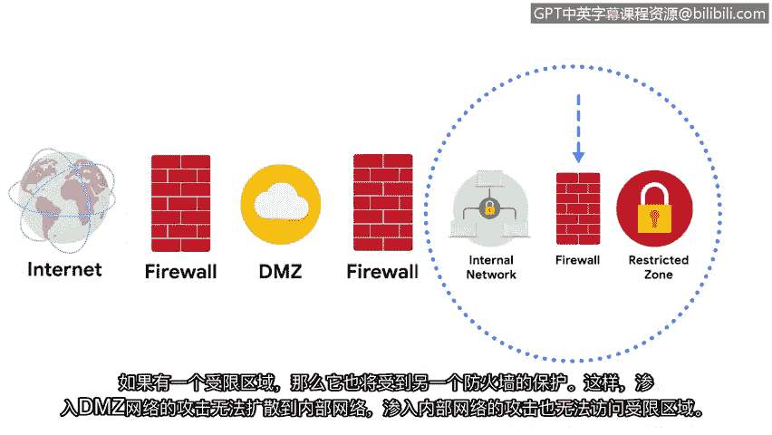

# 020：19_安全区域

## 概述

在本节中，我们将讨论一种称为**安全区域**的网络安全功能。安全区域是网络的一部分，用于保护内部网络免受互联网的威胁。它是**网络分段**这一安全技术的一部分。我们将了解安全区域如何划分网络、控制访问权限，并作为内部网络的屏障。

---

## 什么是安全区域？🛡️

安全区域是网络的一个分段，用于保护内部网络免受互联网的侵害。它属于一种称为**网络分段**的安全技术。该技术将网络划分为多个段。

每个网络段都有自己的访问权限和安全规则。安全区域控制谁可以访问网络的不同部分。它们充当内部网络的屏障，维护公司内部的隐私，并防止问题扩散到整个网络。

---

## 网络分段实例 🏨

为了更好地理解网络分段，我们可以看一个例子。一家提供免费公共Wi-Fi的酒店，其不安全的客用网络与酒店员工使用的另一个加密网络是分开的。

此外，一个组织的网络可以划分为一个或多个**子网**，以维护每个部门的隐私。例如，在一所大学里，可能有一个教职员工子网和一个独立的学生子网。

如果学生子网受到污染，网络管理员可以将其隔离，并保持网络的其余部分不受污染。

---

## 安全区域的类型 🔐

一个组织的网络被分为两种类型的安全区域。

**第一类是无控制区**。这是组织控制范围之外的任何网络，例如互联网。

**第二类是控制区**。这是一个子网，用于保护内部网络免受无控制区的影响。

---

## 控制区内的网络类型 🌐

在控制区内，有几种类型的网络。在最外层是**非军事区**，简称**DMZ**。

DMZ包含面向公众的、可以访问互联网的服务。这包括：
*   **Web服务器**：为公众托管网站的代理服务器。
*   **DNS服务器**：为互联网用户提供IP地址的服务器。
*   处理外部通信的**电子邮件和文件服务器**。

DMZ充当内部网络的网络边界。

---

## 内部网络与限制区 🔒

内部网络包含组织需要保护的私有服务器和数据。在内部网络内部，还有另一个区域，称为**限制区**。

限制区保护高度机密的信息，只有拥有特定权限的员工才能访问。

---

## 安全区域的布局 🏰

现在，让我们尝试描绘这些安全区域。理想情况下，DMZ位于两个防火墙之间。其中一个过滤进入DMZ的流量，另一个过滤进入内部网络的流量。

这为内部网络提供了多层防御。如果存在限制区，它也将受到另一个防火墙的保护。这样，渗透到DMZ网络的攻击就无法扩散到内部网络，而渗透到内部网络的攻击也无法访问限制区。

---

## 安全分析师的角色 👨‍💻

作为安全分析师，您可能负责管理这些防火墙上的访问控制策略。安全团队可以通过限制IP地址和端口来控制到达DMZ和内部网络的流量。

例如，分析师可以确保只允许**HTTPS流量**访问DMZ中的Web服务器。

安全区域是保护网络安全的重要组成部分，尤其是在大型组织中。理解它们的使用方式对所有安全分析师都至关重要。

接下来，我们将学习如何保护内部网络。

---

## 总结 📝

本节课我们一起学习了**安全区域**的概念。我们了解到安全区域是网络分段技术的一部分，用于隔离和保护网络的不同部分。我们探讨了**无控制区**、**控制区**、**DMZ**、**内部网络**和**限制区**等关键区域及其作用。最后，我们看到了安全分析师如何通过配置防火墙策略来管理这些区域的访问控制，从而构建多层防御体系。理解这些概念是规划和维护网络安全架构的基础。