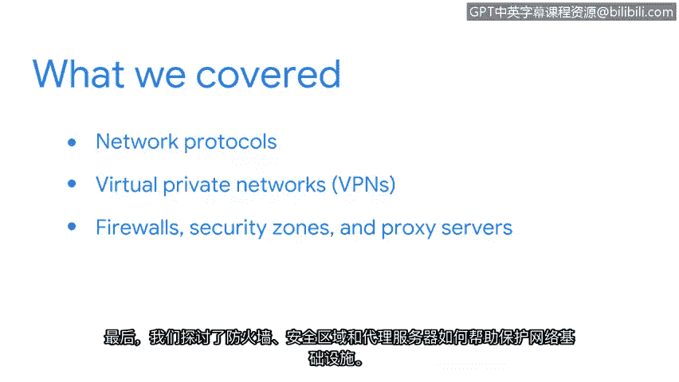

# 022：总结

在本节课中，我们回顾了网络与网络安全部分的核心内容，涵盖了关键的协议、技术和工具。这些知识对于理解网络如何安全运行至关重要。

你已经学习了许多复杂的主题，祝贺你在这个课程中取得了如此大的进展。

让我们回顾一下本节所涵盖的内容。

以下是本节讨论的核心主题：

*   **常见网络协议**：我们讨论了常见的网络协议，如**TCP**、**ARP**、**HTTPS**和**DNS**。
*   **虚拟专用网络**：接着，我们介绍了**虚拟专用网络**如何用于在公共网络上维护隐私。
*   **网络安全基础设施**：最后，我们探讨了**防火墙**、**安全区域**和**代理服务器**如何帮助保护网络基础设施。

总而言之，网络运维是一个涉及多种工具、协议和技术的广阔领域，它们共同确保网络平稳、安全地运行。

你可以随时回来复习这些视频。作为一名安全分析师，无论担任何种类型的职位，你都会用到这些信息。

本节课中，我们一起学习了网络协议的基础、VPN在隐私保护中的作用，以及防火墙等关键安全组件如何构成网络防御体系。掌握这些概念是迈向网络安全专业领域的重要一步。