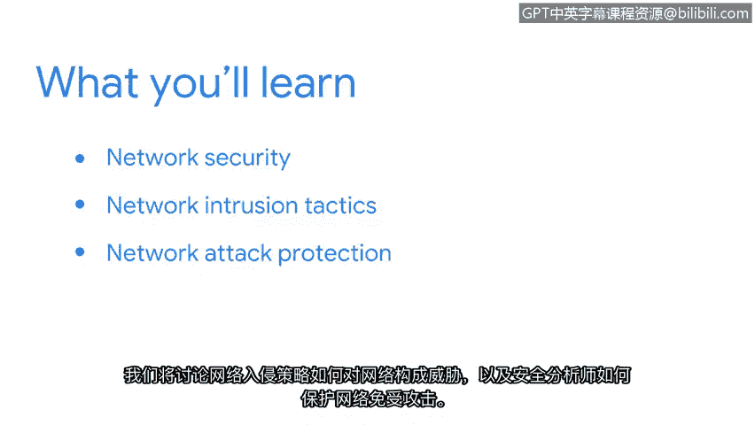

# 023：22_欢迎来到第三周


在本节课中，我们将学习如何保护网络免受攻击。你已经对网络和网络安全有了相当深入的理解。现在，你将学习如何保护网络，确保其中包含的宝贵信息不会落入错误的人手中。

我们将讨论网络入侵策略如何对网络构成威胁，以及安全分析师如何防范网络攻击。让我们开始吧。😊

---

上一节我们介绍了本课程的学习目标。本节中，我们将探讨网络攻击的基本概念。

网络攻击是指未经授权访问或破坏网络、系统或数据的行为。攻击者可能使用多种策略来达成其目的。

以下是几种常见的网络入侵策略：

*   **恶意软件**：指任何旨在损害计算机、服务器或网络的软件。例如：病毒、蠕虫、勒索软件。
*   **网络钓鱼**：通过伪装成可信来源的通信（如电子邮件），诱骗用户泄露敏感信息。
*   **拒绝服务攻击**：通过大量请求淹没目标系统，使其无法为合法用户提供服务。

---

了解了常见的攻击方式后，我们来看看安全分析师如何保护网络。

保护网络的核心在于建立多层防御策略，这通常被称为“纵深防御”。主要防护措施包括：

*   **防火墙**：作为网络边界的安全屏障，根据预设规则控制进出网络的数据流。其核心功能可以用一个简单的规则逻辑表示：
    ```
    IF (数据包来源IP在黑名单中) THEN (阻止数据包)
    ELSE IF (数据包目标端口未授权) THEN (阻止数据包)
    ELSE (允许数据包通过)
    ```
*   **入侵检测与防御系统**：监控网络流量，识别可疑活动。IDS负责**报警**，而IPS则可以主动**阻止**攻击。
*   **访问控制**：确保只有授权用户和设备能够访问特定网络资源。这通常通过身份验证和授权机制实现。

---



本节课中，我们一起学习了网络攻击的基本概念以及核心的防护措施。我们了解到，网络攻击形式多样，如恶意软件、网络钓鱼和拒绝服务攻击。为了保护网络，安全分析师需要实施包括防火墙、入侵检测与防御系统以及访问控制在内的多层防御策略。记住，网络安全是一个持续的过程，需要不断监控和更新防御措施以应对新出现的威胁。


