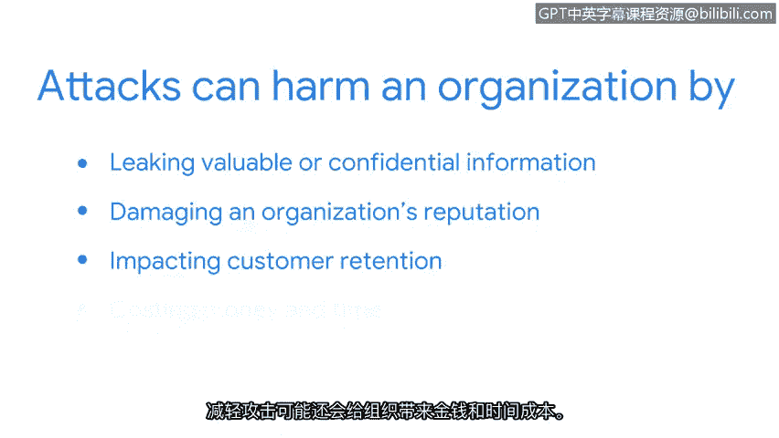

# 024：保护网络的理由

在本节课程中，我们将探讨一个核心问题：为什么我们需要安全的网络？你将了解到网络面临的各种风险，以及保护网络对于组织的重要性。我们还将通过一个真实案例，具体说明网络攻击可能造成的严重后果。

首先，我们来回答这个问题：为什么我们需要安全的网络？正如你已经学到的，网络持续面临着来自恶意行为者的攻击风险。

攻击者可以通过多种方式渗透网络，例如：
*   **恶意软件**：在系统中安装有害软件。
*   **欺骗**：伪装成可信实体以获取访问权限。
*   **数据包嗅探**：截获并分析网络流量以窃取信息。

此外，网络运营也可能被某些攻击所破坏，例如**数据包泛洪攻击**。随着课程的深入，你将更详细地了解这些以及其他常见的网络入侵攻击。

保护网络免受此类攻击至关重要。即使只发生其中一种攻击，也可能对组织造成灾难性影响。攻击可能通过泄露有价值或机密信息来损害组织。它们也可能损害组织的声誉并影响客户留存。缓解攻击还可能耗费组织大量的资金和时间。

在过去的几年里，有许多例子可以说明网络攻击可能造成的损害。一个臭名昭著的例子是2014年针对美国家居建材连锁商家得宝的攻击。

一群黑客入侵并感染了家得宝的服务器。当网络管理员最终关闭攻击时，黑客已经窃取了超过5600万客户的信用卡和借记卡信息。

现在，你知道了保护网络为何如此重要。但要维护网络安全，你需要了解需要防范哪些类型的攻击。接下来，你将学习一些常见的网络攻击。