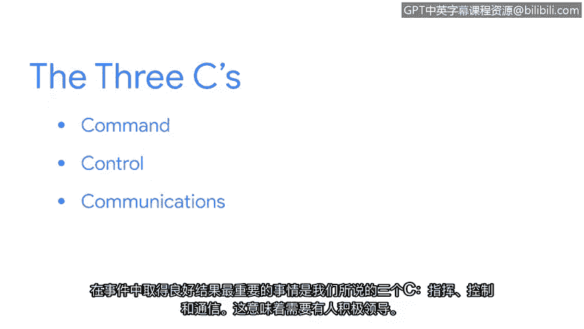

# 025：处理攻击的专业人员

## 概述
在本节课中，我们将跟随谷歌的混乱专家马特，了解网络安全事件响应人员的工作内容、所需心态以及应对攻击的核心原则。你将学习到事件响应不仅仅是技术工作，更是一种帮助他人、在危机中建立秩序的服务。

---

我的名字是马特。我是谷歌的一名混乱专家。公司允许我们选择最能描述自己工作的职位头衔。

我花费大量时间规划如何处理任何可能出错的事情。当问题真正发生时，我会组建团队以尽快修复它。

我最初完全没有进入技术行业的打算。高中时期，我先是在公共泳池当救生员，后来又在州立海滩工作。

救生员的工作让我真正喜欢上了救援。因此我考取了急救医疗技术员执照，并完成了消防员学校的培训。

大约在我大学进程过半，并且每天从事消防员工作的时候，我遇到了一些职业倦怠和压力。我需要改变生活。

一位朋友对我说，他能看出我身心俱疲，需要改变。他和朋友们正要去旧金山创业，问我是否愿意同行。我告诉他，我并非搞计算机的人。他回答说，不，你就是，只是你不愿承认。

吸引我进入技术领域事件响应工作的，与最初吸引我从事医疗救援工作的原因相同。我真的很喜欢在人们最糟糕的一天陪伴他们。

在人们真正需要你、不知该向何处求助时出现，这一直是我内心动力的源泉。我很幸运地在数字取证和事件响应领域找到了同样的乐趣。

谷歌面临过哪些类型的攻击？这是一个难以回答的问题，因为我们面临着大多数其他公司会遇到的所有攻击类型：有人为了勒索软件，有人为了工业机密，还有其他国家为了情报信息。

不久前发生了一次非常有趣的攻击。攻击者有兴趣从技术公司获取大量关于软件漏洞的信息。他们实施了一项长期行动，在社交媒体上塑造看似合法的安全研究员人设。

然后，他们接触我们领域的其他安全研究员，建立关系，并在恰当时机植入一些恶意软件。

遭到已经取得一定进展的对手攻击，压力巨大。你最初的想法和感受会带有一点恐慌。“哦，不，今天会是糟糕的一天。我要为此工作多久？他们做了什么？我该怎么办？”

对我而言，我反复对自己念诵的箴言是：作为一名事件响应者，我在这里是为了提供帮助。

在事件中获得良好结果最重要的因素，我们称之为“三个C”：指挥、控制和沟通。这意味着需要有人负责，积极领导；需要有人对所有参与者实施控制，以确保所有人目标一致，专注于任务；而其中最大、最重要的是：恰当的沟通。

如果你对事件处理有建议，不要直接去做。先与某人沟通。“我认为我可以做这个来帮助我们取得进展。”“我认为如果我们查看这里，会发现更多数据。”

对于想进入网络安全领域的人，我的建议是：如果你想要这份工作，你可能就属于这里。我们行业需要更多充满热情、好奇心强、喜欢提问的人，他们渴望了解更多，希望构建更好的东西，并关心如何让必须使用技术的人们获得更安全的保障。这些人正是我们行业所需要的，我希望你加入我们。

---

## 总结
本节课中，我们一起学习了网络安全事件响应专家的角色与心态。我们了解到，事件响应的核心在于“指挥、控制、沟通”三大原则，其本质与救援工作一样，是在危机中建立秩序并提供帮助。无论背景如何，拥有帮助他人、解决问题热情的人，都可能在网络安全领域找到自己的位置。