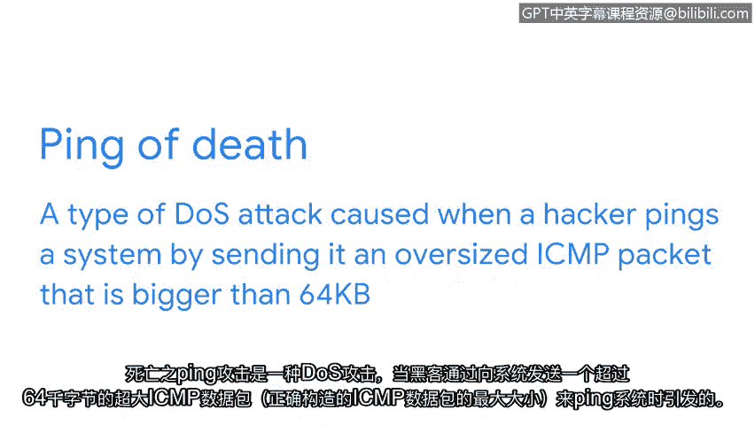

# 026：拒绝服务（DoS）攻击

在本节课中，我们将学习拒绝服务攻击。这是一种通过向目标网络或服务器发送海量流量，使其无法正常运作的攻击方式。我们将了解其基本概念、不同类型以及它们如何利用网络协议来达成攻击目的。

## 概述：什么是拒绝服务攻击？

拒绝服务攻击是一种针对网络或服务器的攻击，其手段是向目标发送大量网络流量。

攻击的目标是通过使组织的网络过载，来扰乱其正常的业务运营。攻击者会向联网设备发送过量信息，导致其崩溃或无法响应合法用户。这意味着组织将无法进行正常的业务操作，从而造成金钱和时间上的损失。网络崩溃还可能使其面临其他安全威胁和攻击。

## 分布式拒绝服务攻击

分布式拒绝服务攻击是一种使用位于不同位置的多个设备或服务器，向目标网络发送大量无用流量的拒绝服务攻击。

使用大量设备使得发送的流量总量更有可能压垮目标服务器。请记住，DoS代表拒绝服务。因此，攻击者使网络的任何部分过载，他们都算成功。一个不幸的例子是，攻击者精心构造了一个数据包，导致路由器花费额外时间处理请求。压垮路由器的不是总体流量，而是数据包内的具体内容。

## 网络层DoS攻击

上一节我们介绍了DoS攻击的基本概念，本节中我们来看看针对网络带宽以减缓流量的网络层DoS攻击。

以下是三种常见的网络层DoS攻击。

### SYN洪水攻击

SYN洪水攻击是一种模拟TCP连接，并向服务器发送大量SYN包的DDoS攻击。

为了更好地理解这个定义，让我们仔细看看在设备与服务器之间建立TCP连接时使用的握手过程。

握手的第一步是设备向服务器发送一个SYN（同步）请求。然后，服务器用SYN-ACK包响应，以确认收到设备的请求，并为握手的最后一步打开一个端口。一旦服务器收到来自设备的最终ACK包，TCP连接就建立了。

恶意行为者可以利用这个协议，在握手的第一阶段向服务器发送大量SYN包请求。但如果SYN请求的数量超过了服务器上可用端口的数量，服务器就会不堪重负，无法正常工作。

### ICMP洪水攻击

接下来，我们讨论另外两种使用名为ICMP的协议的常见DoS攻击。

ICMP代表互联网控制消息协议。ICMP是一种互联网协议，设备用它来相互告知网络上的数据传输错误。可以将ICMP视为向设备请求状态更新。如果存在网络问题，设备将返回错误消息。你可以把这看作是ICMP请求向设备“报到”，以确保一切正常。

ICMP洪水攻击是一种由攻击者反复向网络服务器发送ICMP包而执行的DoS攻击。这迫使服务器发送ICMP响应包。最终，这会耗尽所有进出流量的带宽，并导致服务器崩溃。

到目前为止我们讨论的两种攻击，SYN洪水和ICMP洪水，都是通过发送海量请求来利用通信协议。

### 死亡之Ping攻击

此外，也存在通过一个巨大的请求就能压垮服务器的攻击。我们将讨论的一个例子叫做“死亡之Ping”。

死亡之Ping攻击是一种DoS攻击，当黑客通过发送一个超过64KB（正确格式的ICMP数据包的最大尺寸）的超大ICMP数据包来“Ping”一个系统时，就会引发这种攻击。用一个超大的ICMP数据包Ping一个易受攻击的网络服务器，会使系统过载并导致其崩溃。

可以将其想象成将一块大石头砸在一个小蚁丘上。每只蚂蚁在往返蚁丘运送食物时都能承受一定的重量。但如果一块大石头砸在蚁丘上，许多蚂蚁就会被压死，蚁群在别处重建其运作之前将无法正常活动。

## 总结

本节课中，我们一起学习了拒绝服务攻击。我们了解到，DoS攻击旨在通过流量过载来破坏网络或服务器的正常运作。我们探讨了其基本形式DoS，以及更强大的变体DDoS。接着，我们深入分析了三种具体的网络层攻击：利用TCP握手过程的**SYN洪水攻击**、滥用状态查询协议的**ICMP洪水攻击**，以及通过发送畸形超大包导致系统崩溃的**死亡之Ping攻击**。理解这些攻击的原理是实施有效防御的第一步。在接下来的课程中，我们将继续讨论其他常见的网络攻击。