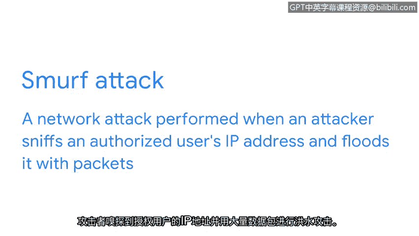

# 028：IP欺骗攻击与防御 🛡️


在本节课中，我们将要学习一种名为“IP欺骗”的网络攻击。我们将了解它的工作原理、几种常见的攻击类型，以及如何配置网络防御来抵御此类攻击。

## 什么是IP欺骗？

上一节我们介绍了网络攻击的基本概念，本节中我们来看看一种具体的攻击手段——IP欺骗。

IP欺骗是一种网络攻击，攻击者通过更改数据包的源IP地址，来冒充一个已授权的系统，从而获取网络访问权限。在这种攻击中，黑客伪装成他人，以便与目标计算机进行网络通信，并绕过可能阻止外部流量的防火墙规则。

## 常见的IP欺骗攻击类型

了解了IP欺骗的基本定义后，以下是三种常见的利用IP欺骗发起的攻击：

*   **中间人攻击**：恶意攻击者将自己置于一个已授权的连接中间，拦截或篡改传输中的数据。攻击者先获取网络访问权限，将自己置于两个设备（如Web浏览器和Web服务器）之间。然后，他们嗅探数据包信息，以获取正在通信的两个设备的IP和MAC地址。获得这些信息后，他们就可以伪装成其中任何一个设备。
*   **重放攻击**：恶意攻击者拦截一个传输中的数据包，并将其延迟或在另一个时间重复发送。延迟的数据包可能导致目标计算机之间的连接问题。或者，攻击者可能截获授权用户发送的网络传输，并在稍后时间重复发送，以冒充该授权用户。
*   **Smurf攻击**：这是分布式拒绝服务攻击与IP欺骗攻击的结合。攻击者嗅探一个授权用户的IP地址，然后用大量数据包淹没该地址。这会使目标计算机不堪重负，并可能导致服务器或整个网络瘫痪。

## 如何防御IP欺骗攻击？



现在我们已经了解了不同类型的IP欺骗攻击，接下来让我们谈谈如何保护网络免受此类攻击。

正如之前所学，应始终实施**加密**，以确保网络传输中的数据不会被恶意行为者读取。

防火墙可以配置以防止IP欺骗。IP欺骗通过更改数据包的发送方地址以匹配目标网络的地址，使恶意行为者看起来像是授权用户。因此，如果防火墙从互联网接收到一个数据包，其发送方IP地址与内部私有网络的地址相同，那么防火墙将拒绝该传输。因为具有该IP地址的所有设备本应已在本地网络上。

你可以通过创建一条规则来确保防火墙配置正确，该规则拒绝所有发送方IP地址与本地网络地址相同的传入流量。代码如下所示（示例为通用规则描述）：
```plaintext
拒绝所有来自互联网且源IP属于本地网段（例如 192.168.1.0/24）的入站数据包。
```


本节课中我们一起学习了IP欺骗攻击。我们了解了IP欺骗如何被用于中间人攻击、重放攻击和Smurf攻击等常见攻击中，并探讨了通过加密和正确配置防火墙规则来防御这些攻击的关键方法。