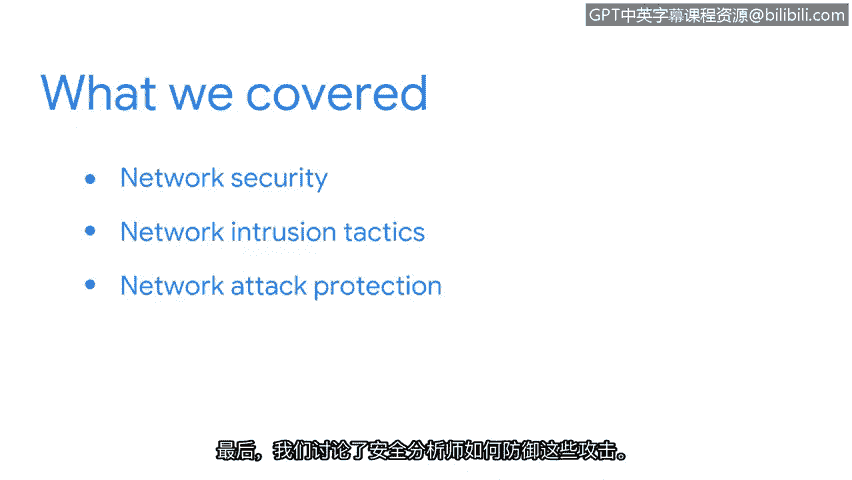

**谷歌网络安全专业证书第三课：连接与保护：网络与网络安全：P29：总结**

在本节课程中，我们回顾了关于网络攻击与防御的核心知识。现在，让我们一起来总结所学内容。

我们首先讨论了如何保障网络的安全。接着，我们学习了网络入侵的常见手段，例如**恶意数据包嗅探**和**IP欺骗**。

最后，我们探讨了安全分析师如何防御此类攻击。

上一节我们介绍了基础的网络入侵方式，本节中我们来看看更具破坏性的攻击类型。

以下是几种拒绝服务攻击的概述：
*   **ICMP洪水攻击**：通过发送大量ICMP请求包耗尽目标资源。
*   **SYN洪水攻击**：利用TCP三次握手过程，发送大量SYN请求但不完成连接，占用服务器连接队列。
*   **死亡之Ping**：发送超过最大允许大小的畸形ICMP数据包，导致目标系统崩溃或重启。

这些攻击的共同目标是向网络倾泻大量无用数据包，试图使其过载瘫痪。

现在，请思考你已经掌握的关于网络攻击的所有知识。你在这些视频中学到的内容，将作为安全分析师工作的基石。

接下来，你将学习安全分析师如何运用各种**安全强化技术**来保护网络。

本节课中，我们一起学习了网络攻击的主要类型及其基本原理，为后续深入探讨具体防护措施奠定了重要基础。