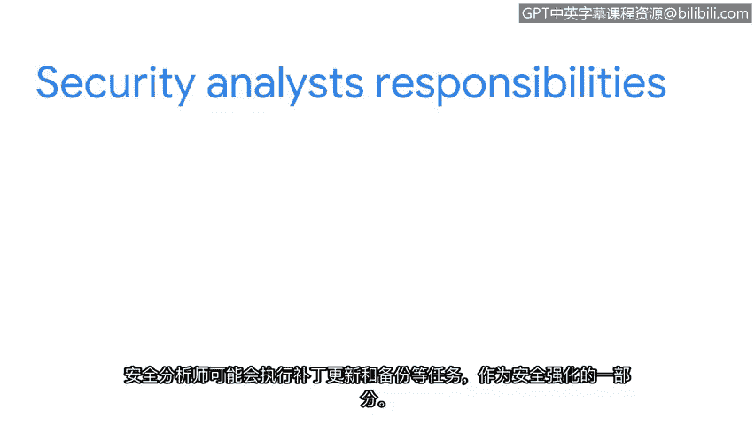

# 030：29_欢迎来到第四周

在本节课中，我们将要学习**安全加固**的基本概念及其在不同层面的应用。安全加固是网络安全实践中的核心环节，旨在通过一系列措施增强系统、网络和应用程序的防御能力，减少潜在的攻击面。

首先，祝贺你已顺利完成前三周的学习。在前面的课程中，你已经了解了网络运营的基础知识，学习了支撑网络系统运行的各种工具与协议，并探讨了网络中的漏洞以及这些漏洞如何导致各种安全入侵。

现在，我们将进入第四周的学习，重点讨论**安全加固**。本节我们将概述安全加固的范畴，并简要介绍后续将深入学习的操作系统加固、网络加固以及云环境加固实践。

安全加固可以在多个层面实施，其核心目标是提升整体安全性。以下是其主要应用领域：

*   **设备加固**：强化单个硬件或软件设备的安全配置。
*   **网络加固**：保护网络架构、通信和数据流。
*   **应用程序加固**：确保软件应用在设计、开发和部署阶段的安全性。
*   **云基础设施加固**：在云环境中实施安全策略与控制。

作为安全分析师，日常工作中会频繁执行与安全加固相关的任务。以下是两个典型例子：

*   **补丁更新**：及时安装软件更新以修复已知漏洞。
*   **数据备份**：定期备份关键数据，确保在遭受攻击或系统故障时可恢复。

随着课程的深入，我们将详细讨论这些任务的具体实施方法。对于安全分析师而言，加固工作在日常职责中占据重要地位，因此深入理解其原理与操作至关重要。

我很高兴能陪伴你继续这段学习旅程。我们下一个视频再见。

本节课中，我们一起学习了安全加固的引入及其重要性，明确了它涵盖设备、网络、应用和云等多个层面，并了解了安全分析师在此过程中的关键任务，如执行补丁更新和备份。这为后续深入探讨具体的加固技术奠定了坚实基础。