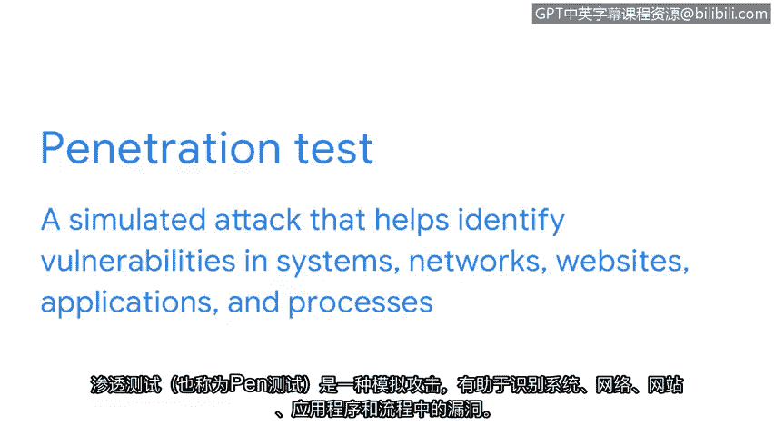

# 031：安全加固

在本节课中，我们将要学习**安全加固**的概念、目的及其在网络安全中的核心作用。安全加固是保护系统免受攻击的关键主动措施，通过减少系统的脆弱性和攻击面来提升整体安全性。

## 什么是安全加固？🛡️

上一节我们介绍了网络安全的基本挑战，本节中我们来看看如何主动强化系统。安全分析师及其所在组织必须主动保护系统免受攻击，这正是安全加固的用武之地。

**安全加固**是指强化系统以减少其脆弱性和攻击面的过程。一个系统的**攻击面**是指威胁行为者可能利用的所有潜在漏洞。

我们可以用一个比喻来理解：将一个网络比作一所房子。攻击面就如同这所房子所有盗贼可能用来进入的门和窗户。安全加固就像给房子的所有门窗装上锁，其目标是**最小化攻击面或潜在漏洞**，并尽可能保持网络的安全。

## 安全加固的范围与维护🔧

安全加固可以在任何可能被攻陷的设备或系统上进行。作为安全加固的一部分，安全分析师会执行定期维护程序，以确保网络设备和系统安全、最优地运行。

以下是安全加固涵盖的主要范围：
*   **硬件**
*   **操作系统**
*   **应用程序**
*   **计算机网络**
*   **数据库**

物理安全也是安全加固的一部分，例如使用安全摄像头和安保人员来保护物理空间。

## 常见的加固措施📋

了解了加固的范围后，我们来看看具体有哪些常见的加固程序。这些措施旨在增强安全性并修复网络上的安全漏洞。

以下是几种常见的安全加固程序类型：
1.  **软件更新**：也称为打补丁。
2.  **设备或应用程序配置更改**：例如，要求使用更长的密码或更频繁地更改密码。这增加了恶意行为者获取登录凭证的难度。另一个配置检查的例子是更新数据库中存储数据的加密标准。保持加密最新能加大恶意行为者访问数据库的难度。

## 通过精简来强化✂️

除了更新和配置，精简系统组件也是有效的加固策略。减少不必要的元素能让监控更高效，并缩小攻击面。

其他安全加固的例子包括：
*   移除或禁用未使用的应用程序和服务。
*   禁用未使用的端口。
*   减少跨设备和网络的访问权限。

**最小化应用程序、设备、端口和访问权限的数量**，能使网络和设备监控更高效，并减少整体攻击面。这是保护组织安全的最佳方法之一。

## 渗透测试：主动发现漏洞🔍

另一种重要的安全加固策略是定期进行渗透测试。**渗透测试**（也称为**Pen Test**）是一种模拟攻击，旨在帮助识别系统、网络、网站、应用程序和流程中的漏洞。

渗透测试人员将他们的发现记录在报告中。根据测试失败的位置，安全团队可以确定需要修复的安全漏洞类型。组织随后可以审查这些漏洞并制定修复计划。

## 总结📚

本节课中我们一起学习了安全加固这一网络安全的基础组成部分。安全加固通过强化网络来减少成功攻击的数量，是确保网络安全的一个重要方面。它涵盖了从软件更新、配置更改到系统精简和主动渗透测试等一系列主动防御措施，是构建健壮网络防御体系的关键。

