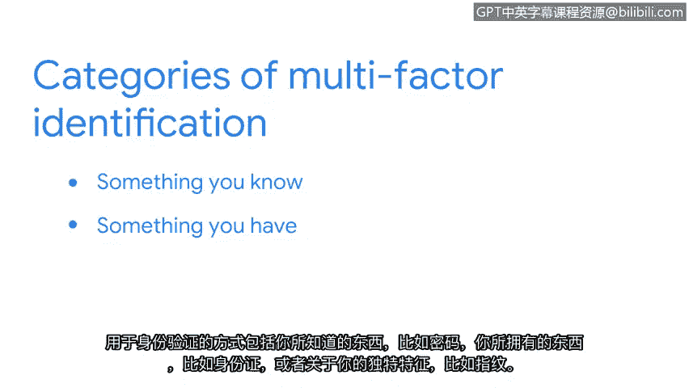

# 032：操作系统加固实践

在本节课程中，我们将学习操作系统加固的概念、重要性以及具体实践方法。操作系统是计算机硬件与用户之间的接口，也是计算机启动时加载的第一个程序。确保操作系统的安全对于保护整个网络至关重要。

## 什么是操作系统加固？

操作系统是软件应用程序与计算机硬件之间的中介。由于一个不安全的操作系统可能导致整个网络被攻陷，因此保护每个系统中的操作系统是网络安全的基础工作。尽管存在多种类型的操作系统，但它们都遵循相似的安全加固实践。

## 定期执行的加固任务

上一节我们介绍了操作系统加固的基本概念，本节中我们来看看那些需要定期执行的安全加固任务。这些任务对于维持系统的长期安全状态至关重要。

以下是需要定期执行的关键加固任务：

*   **补丁安装**：也称为补丁更新，这是由操作系统软件供应商提供的、用于修复程序或产品中安全漏洞的软件和操作系统更新。组织应在补丁发布后尽快运行更新，因为恶意行为者一旦知道漏洞位置，就会攻击运行过时系统的设备。例如，安全团队可能需要紧急修补一个常用编程库中发现的漏洞。
*   **更新基线配置**：补丁安装后，应将新更新的操作系统添加到**基线配置**中。基线配置是系统内一组有文档记录的规范，用作未来构建、发布和更新的基础。例如，一个基线可能包含带有允许和禁止网络端口列表的防火墙规则。如果安全团队怀疑操作系统受到异常活动影响，可以将当前配置与基线进行比较，以确保没有发生未经授权的更改。
*   **硬件和软件处置**：确保所有旧硬件被正确擦除数据并妥善处置。同时，删除任何未使用的软件应用程序也是一个好习惯，因为某些流行编程语言存在已知漏洞。移除未使用的软件可以确保没有与这些软件所用程序相关的不必要漏洞。
*   **维护清单**：定期更新设备清单和授权用户列表。

## 一次性执行的初步安全措施

除了定期任务，有些加固措施作为初步安全设置，通常只需执行一次。

以下是一次性配置任务的例子：

*   **配置设备设置**：例如，将设备设置配置为符合安全的加密标准。

## 实施强密码策略

另一个重要的操作系统加固技术是实施强密码策略。强密码策略要求密码遵循特定规则。

以下是强密码策略的常见要素：

*   **密码复杂性**：例如，组织可能设置要求密码至少包含8个字符、一个大写字母、一个数字和一个符号的策略。
*   **访问限制**：为了阻止恶意行为者，密码策略通常规定用户连续输入错误密码达到一定次数后，将失去网络访问权限。
*   **多因素认证**：一些系统还要求**多因素认证**。MFA是一种安全措施，要求用户通过两种或更多方式验证其身份才能访问系统或网络。验证方式包括：你知道的东西（如密码）、你拥有的东西（如身份证）、你独有的特征（如指纹）。

## 总结与预告

本节课中我们一起学习了操作系统加固。操作系统加固是一套用于维护和提升操作系统安全性的程序。像访问权限和密码策略这样的安全措施，作为操作系统加固的一部分，需要经常进行定期安全检查。

回顾一下，我们讨论了定期任务（如补丁更新和基线维护）和一次性措施（如安全配置），并强调了强密码策略和多因素认证的重要性。

接下来，我们将讨论网络加固的实践方法。