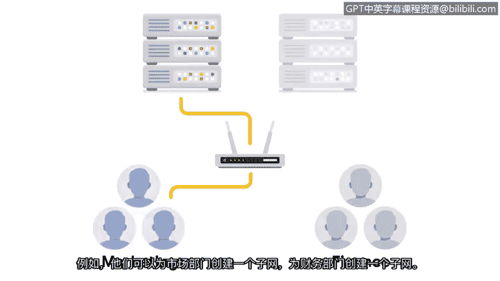

# 033：网络加固实践 🔒

在本节课中，我们将学习网络加固的核心概念与实践方法。网络加固是保护组织网络免受威胁的关键过程，它涉及一系列旨在减少攻击面、增强安全性的配置与维护任务。我们将探讨定期执行的任务与一次性配置的任务，并了解相关的工具与技术。

## 概述

之前我们学习了操作系统加固，它侧重于设备安全，并运用补丁更新、安全配置和账户访问策略。本节我们将聚焦于**网络加固**。网络加固侧重于与网络相关的安全强化措施，例如端口过滤、网络访问权限和网络加密。

## 定期执行的网络加固任务

某些网络加固任务需要定期执行，以确保持续的安全态势。以下是需要定期进行的关键任务：

*   **防火墙规则维护**：定期审查和更新防火墙规则，确保只有必要的流量被允许通过。
*   **网络日志分析**：检查网络日志以识别感兴趣或可疑的事件。
*   **补丁更新**：为网络设备（如路由器、交换机、防火墙）应用最新的安全补丁。
*   **服务器备份**：定期备份关键网络服务器和数据，以便在发生安全事件时能够恢复。

上一节我们介绍了定期任务，现在我们来深入了解其中一项关键活动：网络日志分析。

### 网络日志分析

日志是记录组织系统内发生事件的文档。**网络日志分析**是检查网络日志以识别感兴趣事件的过程。安全团队使用日志分析工具或**安全信息与事件管理**工具（也称为 **SIEM**）来执行网络日志分析。

SIEM 工具是一种收集和分析日志数据以监控组织关键活动的应用程序。它从网络收集安全数据，并将这些数据呈现在一个统一的仪表板上。这个仪表板界面有时被称为“单一玻璃面板”。SIEM 帮助分析师根据优先级检查、分析网络中的安全事件并做出响应。

来自 SIEM 的报告会提供一份新的或持续存在的网络漏洞列表，并按优先级从高到低进行排序。其中，**高优先级漏洞的缓解期限要短得多**。

## 一次性执行的网络加固任务

现在我们已经介绍了定期执行的任务，让我们来检查那些通常只需配置一次，然后根据需要更新的任务。这些任务包括防火墙上的端口过滤、网络访问权限和通信加密等。

以下是主要的一次性配置任务：

*   **端口过滤**：这是防火墙的一项功能，用于阻止或允许特定的端口号，以限制不必要的通信。一个基本原则是：**只允许需要的端口**。任何正常网络操作未使用的端口都应被禁止。这有助于防范端口漏洞。
*   **禁用旧协议**：网络应配置为使用最新的可用无线协议，并应禁用旧的、不安全的无线协议。
*   **网络分段**：安全分析师使用网络分段为组织中的不同部门创建隔离的子网。例如，他们可能为市场部创建一个，为财务部创建另一个。这样做是为了确保每个子网中的问题不会蔓延到整个公司，并且只有指定的用户才能访问其角色所需的那部分网络。网络分段也可用于分隔不同的安全区域。网络中任何包含高度机密或敏感数据的受限区域应与网络的其他部分隔离。
*   **网络通信加密**：所有网络通信都应使用最新的加密标准进行加密。**加密标准**是用于隐藏传出数据和揭示（或解密）传入数据的规则或方法。受限区域中的数据应采用更高的加密标准，这使得它们更难被访问。

## 总结

本节课中，我们一起学习了网络加固的常见实践。你了解了需要定期执行的任务（如日志分析和防火墙维护）以及通常一次性配置的任务（如端口过滤、网络分段和加密）。这些知识对于你完成证书课程以及未来作为安全分析师的职业生涯都至关重要。掌握这些核心的防护措施，是构建强大网络安全防御体系的基础。