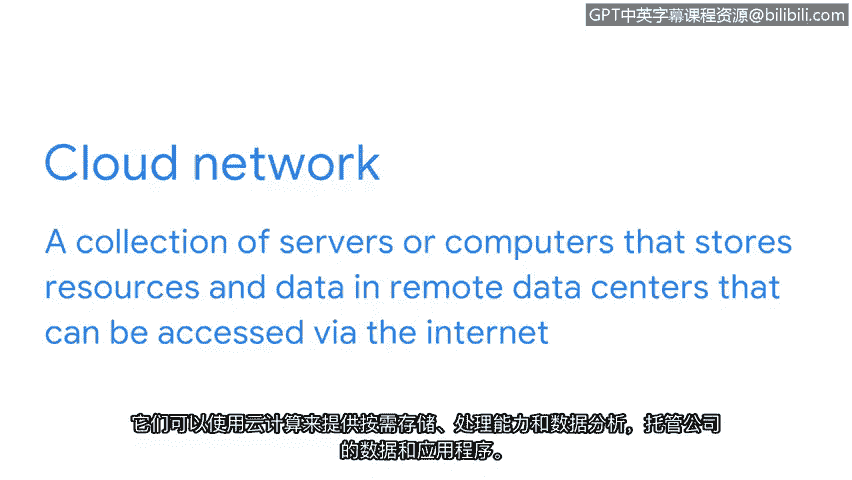

**谷歌网络安全专业证书第三课：《连接与保护：网络与网络安全》：P34：云中的网络安全** 🌥️

在本节课程中，我们将探讨云环境下的网络安全。随着越来越多的组织将网络服务迁移到云端，安全分析师不仅需要保护本地网络，还必须掌握保护云网络的知识与技能。

---

### **概述：什么是云网络？**

在之前的视频中，我们了解到，**云网络**是一个由服务器或计算机组成的集合，它将资源和数据存储在远程数据中心，用户可以通过互联网进行访问。云网络利用**云计算**技术来托管公司的数据和应用程序，提供按需的存储、处理能力和数据分析服务。

`云网络 = 远程数据中心服务器集合 + 互联网访问 + 按需计算资源`

---

### **云服务器的安全维护**

与传统的网络服务器一样，云服务器也需要通过一系列**安全强化程序**进行妥善维护。尽管云服务器由云服务提供商托管，但这些提供商无法完全防止云环境中的入侵，尤其是来自组织内外的恶意行为者的攻击。

上一节我们介绍了网络安全的基础，本节中我们来看看云环境下的特殊安全考量。

---

### **云网络强化的关键：服务器基线镜像**

云网络强化与传统网络强化的一个关键区别在于，云中存储的所有服务器实例都使用一个**服务器基线镜像**。这允许你将云服务器中的数据与基线镜像进行比较，以确保没有发生任何未经核实的更改。

`安全监控：比较（当前云服务器状态）==（基线镜像状态）`

未经核实的更改可能源自云网络中的入侵。因此，定期进行此类比对是检测异常活动的重要手段。

---

### **云中的数据与应用程序隔离**

类似于操作系统强化，云网络上的数据和应用程序应根据其服务类别进行隔离。以下是需要遵循的隔离原则：

*   **新旧应用隔离**：旧版应用程序应与新版应用程序分开部署和管理。
*   **内外功能隔离**：处理内部功能的软件应与用户可见的前端应用程序保持分离。

这种隔离策略有助于限制攻击面，防止一个区域的漏洞影响到其他关键部分。

---

### **共同责任模型下的组织职责**

尽管云服务提供商与使用其服务的组织之间存在**共同责任模型**，但组织自身仍需采取安全措施来确保其云网络的安全。提供商负责“云本身的安全”（如基础设施），而组织则需负责“云内部的安全”（如数据、应用程序、访问控制）。

就像保护传统网络一样，云中的各项操作也必须得到安全保障。

---

### **总结**

本节课中，我们一起学习了云网络安全的核心概念。我们明确了云网络的定义，理解了其安全维护的必要性，并掌握了两个关键实践：使用**服务器基线镜像**进行状态监控，以及对云中的**数据和应用程序进行逻辑隔离**。最后，我们强调了在共同责任模型下，组织自身在保护云环境安全中扮演的不可或缺的角色。掌握这些知识，是成为一名全面的网络安全分析师的重要一步。