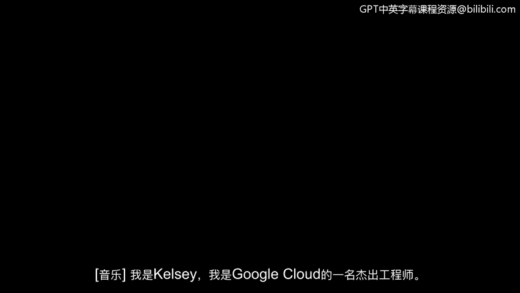
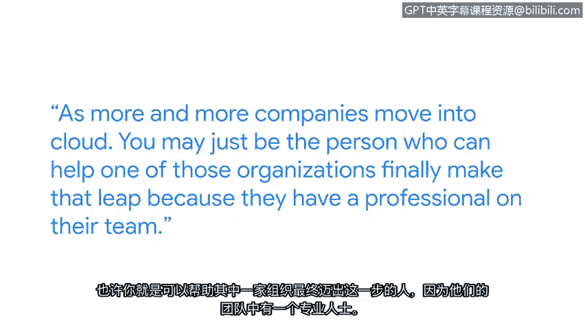

**谷歌网络安全专业证书第三课：《连接与保护：网络与网络安全》 - P35：云安全入门**

**概述**
在本节课程中，我们将跟随谷歌云的杰出工程师凯尔西，了解她进入科技行业的个人经历，并学习关于云安全的核心概念。我们将探讨从传统数据中心到云计算的演变，以及如何开始实践并掌握云安全技能。

---

**从职业起点到技术世界**
凯尔西在职业生涯初期，认为自己能胜任的工作只有快餐行业。她渴望一份事业，而不仅仅是一份工作。因此，她退一步思考自己的职业选择。在1999年，她认为没有比进入科技世界更好的领域了。当时，新闻里人们排队购买最新的操作系统，科技从业者仿佛是新的摇滚明星。她记得翻阅分类广告中的职位空缺时看到，任何拥有特定认证的人都可以联系他们，因为他们正在招聘。对她而言，开启梦寐以求的职业生涯与获得第一份工作之间的差距，只是一本价值35美元的认证书籍。

**从私有云到公有云**
接下来，我们来谈谈云。在云计算出现之前，大多数公司拥有自己的数据中心。可以想象成独自一人住在房子里，你可以把东西放在任何地方，甚至可能选择从不锁内门，因为只有你自己。在很长一段时间里，我们的行业就是这样运行数据中心的。现在我们称之为**私有云**，因为只有你自己在那里。而云是**公有**的。一个恰当的类比是想象有了室友。这时，你会开始以不同的方式看待自己的物品，即使在家也会开始锁东西，你的安全习惯也会变得截然不同。

**掌握云安全技能**
随着越来越多的公司迁移到云端，你可能正是那个能帮助某个组织最终实现这一飞跃的人，因为他们团队中拥有了一位专业人士。好了，假设你已经获得了认证，掌握了基本技能，如何确保你能够在云中实际运用它们呢？我要告诉你一个小秘密：**去使用云**。

以下是开始实践的建议：
*   **部署与测试**：拿一个现有的软件，把它扔到云里。然后，使用各种工具对你刚刚运行起来的东西进行探测和测试。
*   **学习专业工具**：这些工具会告诉你系统的薄弱环节在哪里。学习这些工具，因为专业人士使用的正是它们。

**总结**
本节课中，我们一起学习了凯尔西进入科技行业的激励故事，理解了私有云与公有云的核心区别，并掌握了开始云安全实践的关键方法：**积极动手使用云平台并学习专业测试工具**。学习是一种超能力，它不仅能帮助你获得心仪的工作，还能让你有能力定义自己的下一个职业目标。