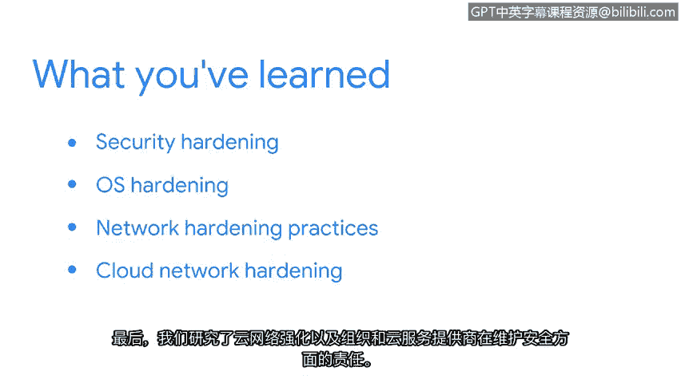

**网络安全专业证书课程：第三课：连接与保护：网络与网络安全 - P36：总结**

在本节课程中，我们共同学习了安全加固的核心概念与实践方法。安全加固对于保护组织的基础设施至关重要，它通过强化系统和网络来降低遭受攻击的可能性。

接下来，我们将回顾本节涵盖的四个主要方面。

以下是安全加固涉及的关键领域：

*   **系统安全加固**：我们首先讨论了如何通过强化系统来提升整体安全性。
*   **操作系统加固**：接着，我们探讨了操作系统加固的重要性，包括**补丁更新**、**基线配置**以及硬件和软件的**安全处置**。
*   **网络加固实践**：然后，我们深入研究了网络加固的具体实践，例如**网络日志分析**和**防火墙规则维护**。
*   **云网络加固**：最后，我们审视了云网络加固，并明确了组织与云服务提供商在维护安全方面的共同责任。

---

作为安全分析师，您将在职业生涯中频繁接触本地网络和云网络中的操作系统。本节所学的全部知识，都将成为您工作中不可或缺的工具。

**总结**

本节课中，我们一起学习了安全加固的完整框架：从理解其重要性开始，到掌握操作系统、本地网络及云环境的具体加固策略。这些知识构成了构建和维护安全防御体系的基础。