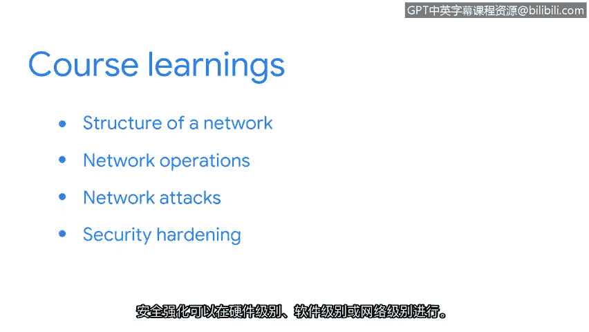

# 037：课程总结

在本节课中，我们将回顾《连接与保护：网络与网络安全》课程的核心内容，总结关于网络结构、安全实践以及分析师职责的关键知识。

---

我们在这门课程中涵盖了大量内容。现在回顾一下我们讨论过的所有主题。

你学习了网络、网络架构以及安全专业人员用于保护网络免受安全漏洞侵害的最佳实践。

随着课程接近尾声，我们来回顾一下目前学到的关于网络安全的知识。

首先，我们探讨了网络的结构。安全分析师必须理解网络的设计方式，以便识别网络中存在的漏洞以及接下来需要加固的部分。

我们学习了网络操作及其如何影响数据的通信。

网络协议决定了数据如何在网络上传输。

当通信在网络上发生时，恶意行为者可能会使用诸如拒绝服务攻击、数据包嗅探和IP欺骗等策略。安全分析师会采用防火墙规则等工具和措施来防范这些攻击。

我们还讨论了安全加固。安全加固用于减少网络的受攻击面。这意味着攻击不会使整个网络瘫痪。安全加固可以在硬件层面、软件层面或网络层面进行。

---

保障网络安全是安全分析师职责的重要组成部分。掌握网络及其操作和安全实践的知识，将确保你在安全分析师的职业生涯中取得成功。

这引出了我们下一门课程的主题，该课程将涵盖安全分析师的计算基础。在那门课程中，你将学习如何使用Linux命令行来认证和授权网络上的用户，并使用SQL（即结构化查询语言）与数据库进行通信。

能坚持到这里，做得很好。你在本节中学到的所有概念，对于你成功担任安全分析师的角色都至关重要。

现在，你可以继续学习下一门课程了。祝你学习愉快。