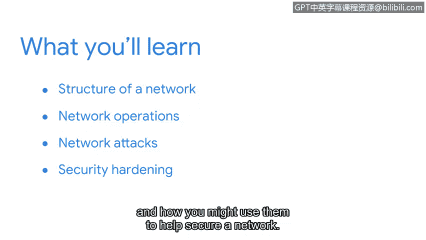

**连接与保护：网络与网络安全：课程3：课程介绍** 😊

在本课程中，我们将深入学习网络安全领域中的一个核心部分：网络。我们将探讨网络的基本结构、常用工具、常见攻击方式以及如何通过安全加固来保护网络。

---

在之前的课程中，你已经了解了安全领域。现在，我们将对其中的一个领域——网络——进行更深入的探索。

确保网络安全至关重要，因为基于网络的攻击在频率和复杂性上都在不断增长。

大家好，我是Chris，担任Google Fiber的首席信息安全官。我很荣幸能担任本课程的讲师。我在网络安全和工程领域已有超过20年的工作经验，期待与大家分享我的知识和经验。

本课程将帮助你理解网络的基本结构（也称为网络架构）以及常用的网络工具。你还将学习网络操作，并探索一些基本的网络协议。

接下来，你将了解常见的网络攻击，以及网络入侵防御策略如何阻止对网络的威胁。

最后，本课程将概述安全加固实践，以及你如何运用它们来帮助保护网络。

网络安全领域有许多知识需要学习。我期待与你一同踏上这段旅程。准备好开始了吗？我们出发吧。

---

本节课中，我们一起学习了本课程的核心目标：深入探索网络架构、工具、协议、攻击与防御，以及安全加固实践，为后续的详细学习奠定了基础。