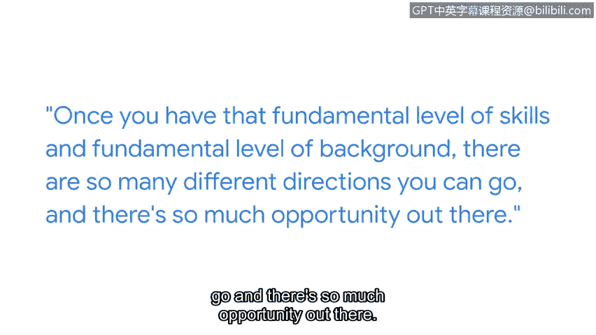

# 040：我的网络安全之路

## 概述
在本节课程中，我们将跟随谷歌Fiveber公司的首席信息安全官克里斯，了解他如何从一名软件开发者成长为网络安全专家。他的职业路径展示了网络安全领域的多样性与机遇，并强调了持续学习和人际网络的重要性。

## 职业起点与转折
我的名字是克里斯，我是谷歌Fiveber公司的首席信息安全官。我们为全美客户提供高速互联网服务。作为首席信息安全官，我的职责是确保网络安全、保护客户数据安全，并根据需要为执法部门及其他机构提供支持。

我的职业道路漫长且曲折。我的第一份工作是在家族杂货店当屠夫。我最终在大学计算机中心找到了一份工作，在那里我学到了许多最初的计算机技能。

## 从软件开发到网络安全
大学毕业后，我最初成为一名软件开发者，为一家支持农业部的咨询公司设计会计软件。之后我转换了其他角色，最终进入了一家早期的有线互联网公司。我负责运营他们的多项服务，例如电子邮件和网页服务。

我构建的系统不断遭到攻击。我之所以进入网络安全领域，是因为我必须保护自己构建的东西。我意识到这很有趣，也意识到这是一个绝佳的职业机会。因此，从那以后我一直坚持在这个领域。

## 学习资源与行业现状
当我进入这个领域时，除了几本书之外，没有太多的培训材料。有一些人可以让我提问并获得一些指导。但总的来说，我是靠自己摸索的。

尽管这是一个技术性很强的领域，但你要学习的最重要的东西是你将要建立的人际关系。我主动决定积极参与一些外部工作组织、行业协会、非营利组织、聚会和其他网络安全组织。

## 建立人际网络的重要性
这使我能够建立声誉和关系。因此，随着我的职业发展，人们开始主动联系我，询问我是否有兴趣参与新的机会。

因为网络安全行业非常多样化，看起来似乎有海量的知识需要学习，有巨大的台阶需要跨越。为了进入这个行业，这可能会让人望而生畏。

## 克服入行障碍
但要记住的是，一旦你掌握了基础技能和背景知识，你就有许多不同的方向可以选择，并且有大量的机会在等着你。

## 持续学习与职业乐趣
这份工作具有持续教育和保持好奇心的特点，这非常有趣。这意味着你总是有机会学习新事物，改变方向，探索新的道路，因为网络安全领域将不断变化。而这正是乐趣的一部分。

## 总结
本节课中，我们一起学习了克里斯从非技术背景成长为首席信息安全官的职业路径。他的经历告诉我们，网络安全领域入门虽具挑战，但拥有基础技能后便前景广阔。关键在于保持持续学习的好奇心，并积极构建专业人际网络，因为机遇往往蕴藏于与他人的连接之中。