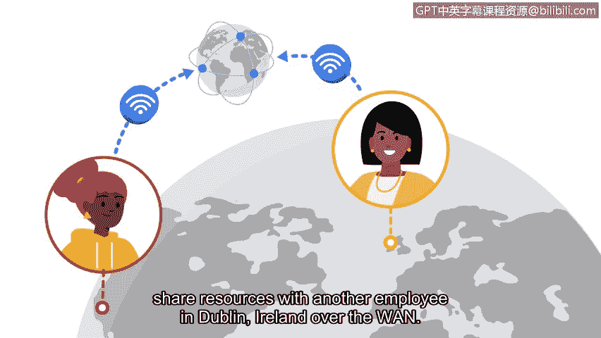

**谷歌网络安全专业证书第三课：《连接与保护：网络与网络安全》 - P41：3_03_什么是网络**

**概述**

在本节课程中，我们将学习网络的基础概念。理解什么是网络，是学习如何保护网络的第一步。我们将介绍网络的定义、组成、通信方式以及两种主要的网络类型。

**什么是网络？**

网络是一组相互连接的设备。在家庭环境中，连接到网络的设备可能包括你的笔记本电脑、手机以及智能设备，例如冰箱或空调。在办公室环境中，工作站、打印机和服务器等设备都会连接到网络。

网络上的设备可以通过网线或无线连接进行相互通信。

**网络通信与地址**

家庭和办公室的网络可以与其他位置的网络及其上的设备进行通信。设备需要在网络上找到彼此才能建立通信。这些设备会使用唯一的地址或标识符来定位对方。这些地址确保通信发生在正确的设备之间。这些地址被称为 **IP地址** 和 **MAC地址**。

**网络类型**

设备可以在两种类型的网络上进行通信：局域网和广域网。

*   **局域网**：也称为 **LAN**，覆盖一个小范围区域，例如办公楼、学校或家庭。例如，当你的手机或平板电脑连接到家里的Wi-Fi时，它们就形成了一个局域网。这个局域网随后会连接到互联网。
*   **广域网**：也称为 **WAN**，覆盖一个大的地理区域，例如城市、州或国家。你可以将互联网视为一个巨大的广域网。

通过广域网，位于美国旧金山的一家公司员工可以与位于爱尔兰都柏林的另一名员工进行通信和共享资源。

**总结**

本节中，我们一起学习了网络的基本概念。我们了解到网络是连接设备的集合，设备通过IP和MAC地址相互识别和通信，并且网络主要分为覆盖小范围的局域网和覆盖大范围的广域网。

现在你已经了解了网络的结构和类型，在接下来的视频中，我们将一起学习连接到网络的设备。

