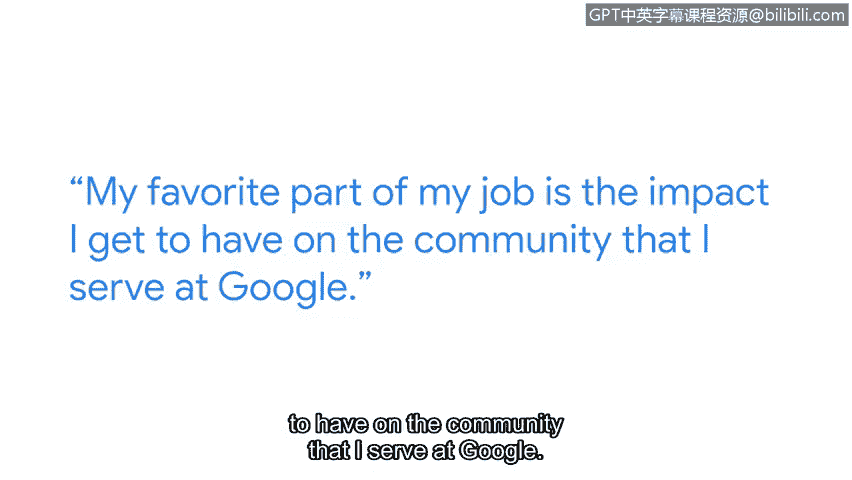

# 042：4_04_蒂娜的网络安全工作

在本节课程中，我们将跟随谷歌软件工程师蒂娜，了解她在网络安全领域的具体工作内容、日常职责以及她对初学者的建议。通过学习，你将理解网络安全工程师的实际工作场景和所需的核心技能。

## 自我介绍与工作概述

我的名字是蒂娜，我是谷歌的一名软件工程师。

作为一名软件工程师，我负责开发一个内部工具，该工具服务于谷歌的安全工程师和网络工程师。

网络安全至关重要，因为它能确保我们的网络系统安全且具有韧性，能够抵御恶意黑客的攻击，并保护用户数据。

从事网络安全工作，你可以看到整个公司网络系统的全貌，这非常酷。

## 日常工作内容与职责

上一节我们了解了蒂娜的工作概述，本节中我们来看看她具体的日常工作内容。

我最喜欢工作的部分，是能够对我所服务的谷歌内部社区产生影响。

我一天中的大部分时间都在进行大量编码、设计工作，与安全团队和网络团队沟通他们的工作优先级和遇到的阻碍，并共同制定解决方案。

以下是工作中常见的任务流程：

1.  **接收需求**：网络团队和安全团队经常会提出特定请求。
2.  **分析需求**：这些请求通常对某些平台或网络策略中的特定功能有具体要求。
3.  **处理与解决**：我们通常会升级处理这些请求，并努力制定修复方案。

## 给初学者的建议与行业洞察

了解了网络安全工程师的日常工作后，我们来看看蒂娜对想要进入这一领域的人有何建议。

对于想要踏上网络安全之旅的人，我给出的一个建议是：始终保持学习，并对事物的工作原理充满好奇。

因为安全是一个不断变化的领域。

网络安全绝对是一个团队合作的领域。每个人都能做出贡献，尤其是在网络安全问题上，一个问题可能存在多种可能性和不同的解决方案。

能够与他人一起头脑风暴、共同追踪问题总是很棒，因为有时事情会变得非常复杂，但共同协作解决问题也是一个有趣的过程。

## 总结

本节课中，我们一起学习了谷歌软件工程师蒂娜在网络安全岗位上的工作分享。我们了解到网络安全工作涉及工具开发、跨团队协作以解决具体策略需求，并且这是一个需要持续学习、充满好奇心以及注重团队合作的动态领域。对于初学者而言，保持热情并乐于协作是开启网络安全职业生涯的重要一步。