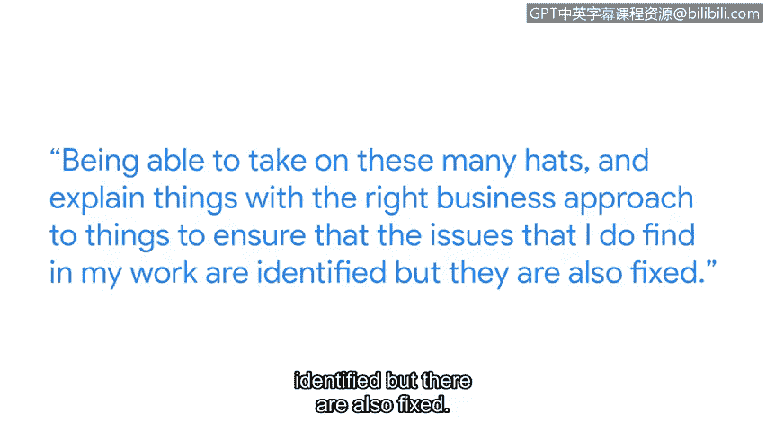

# 043：5_05_Emmanuel-网络安全实用技能

## 概述 📋

在本节课中，我们将跟随谷歌的进攻性安全工程师 Emmanuel，了解网络安全领域所需的实用技能。我们将探讨从基础命令行操作到高级网络流量分析等一系列核心技能，并理解有效沟通在解决安全问题中的重要性。

## 自我介绍与工作职责 👨‍💻

我叫 Emmanuel，是谷歌的一名进攻性安全工程师。我的工作是模拟针对各类公司的攻击者和威胁，并研究如何保护谷歌的基础设施。我的目标是让攻击谷歌变得更加困难，实际上就是在谷歌内部进行“黑客”活动。

## 核心技术技能 🛠️

上一节我们了解了 Emmanuel 的工作角色，本节中我们来看看他在日常工作中使用的核心技术技能。这些技能主要包括编程，以及学习操作安全和平台安全。这意味着需要知道计算机如何工作、其内部原理，并理解构成整个基础设施的各个组件。

对于初级网络安全职位，日常工作范围通常涉及以下三项核心技能：

以下是初级网络安全人员需要掌握的三项核心技能：

1.  **使用命令行**：命令行允许你与操作系统的各个层级进行交互，无论是像内存和内核这样的底层组件，还是像你在计算机上编写的应用程序和程序这样的高层级内容。
2.  **日志分析**：有时你可能需要找出并调试你的程序或应用程序中正在发生的问题。日志的存在就是为了帮助你、支持你找到根本问题，并据此解决它。
3.  **网络流量分析**：有时你可能需要弄清楚为什么我的网速变慢了？为什么流量没有被路由到正确的目的地？我能做些什么来确保我的网络正常运行？网络流量分析就是查看跨越不同应用层和网络层的网络活动，观察流量在做什么，我们如何保护这些流量，以及识别其中的任何漏洞和隐患。

## 安全背景下的技能应用 🔍

在了解了基础技能后，我们来看看这些技能在具体的安全场景中是如何应用的。对我来说，在安全背景下，我会关注在网络中传输的流量里是否有密码泄露，我们的基础设施是否安全，以及防火墙是否已正确且安全地配置。

## 一项持续成长的软技能 📈

除了技术硬技能，有一项技能在我目前的角色中持续成长，那就是有效地与产品团队和工程师沟通，识别出正在影响业务的问题，并有效地与这些团队沟通以修复它。这意味着能够身兼多职，并用正确的业务方法解释事情，以确保我在工作中发现的问题不仅被识别出来，而且能得到解决。

## 给学习者的建议 💡

最后，我想给正在学习这个证书课程的朋友们一些建议：拆解事物，勇于面对不适，不断学习成长，并寻找机会去学习和理解事物的工作原理。这套技能组合将在你未来的整个职业生涯中使你受益。

## 总结 ✨

本节课中，我们一起学习了网络安全工程师 Emmanuel 分享的实用技能。我们从**命令行操作**、**日志分析**和**网络流量分析**这三项基础技术技能入手，了解了它们在识别漏洞（如`密码泄露`）和确保基础设施安全方面的应用。更重要的是，我们认识到**有效沟通**这项软技能对于推动问题解决的关键作用。记住他的建议：保持好奇心，勇于实践，这种持续学习和拆解问题的能力将是你在网络安全领域最宝贵的财富。