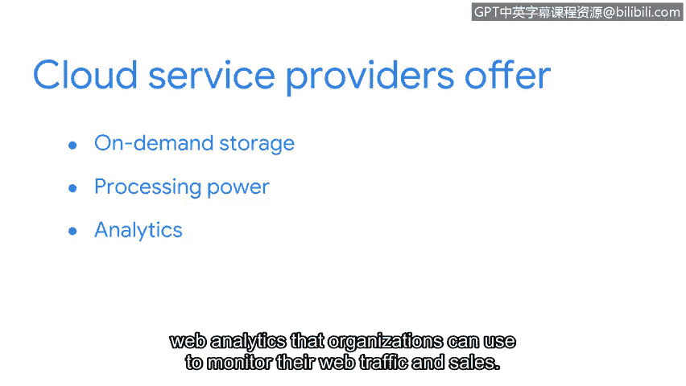

# 045：云网络与安全

## 概述
在本节课中，我们将要学习云网络的基本概念、它与传统网络的区别，以及云安全的重要性。随着越来越多的企业采用云服务，理解这些内容对于网络安全专业人员至关重要。

---

## 云网络的定义与兴起

传统上，公司拥有自己的网络设备，并将它们存放在自己的办公楼内。但现在，许多公司开始使用第三方提供商来管理其网络。

这种模式帮助公司节省成本，同时让它们能够访问更多的网络资源。云计算的增长正在帮助许多公司降低成本并简化其网络运营。

云计算是指使用托管在互联网上的远程服务器、应用程序和网络服务，而非本地物理设备的实践。如今，使用云计算的企业数量每年都在增加，因此理解云网络的运作方式及其安全防护至关重要。

---

## 云网络与传统网络的区别

云提供商提供了传统本地网络的替代方案，使组织能够享受传统网络的优势，而无需自行存储设备和管理网络。

一个**云网络**是存储在远程数据中心、可通过互联网访问的服务器或计算机的集合。由于公司不在其物理位置安置这些服务器，这些服务器被称为位于“云”中。

传统网络在其物理位置托管企业的网络服务器。然而，云网络与传统网络不同，因为它们使用远程服务器，这使得在线服务和网络应用程序可以从任何地理位置使用。

---

## 云安全的重要性

随着更多组织迁移到云服务，云安全对许多安全专业人员来说将变得越来越重要。

云服务提供商提供云计算来维护应用程序。例如，他们提供按需存储和处理能力，客户只需按需付费。他们还提供企业和网络分析服务，组织可以用这些服务来监控其网络流量和销售情况。

---

## 安全焦点的演变

随着向云网络的过渡，我见证了基于身份的安全措施与更传统的基于网络的解决方案之间的重叠。这意味着我的关注点需要同时放在验证流量的来源以及伴随流量的身份上。

越来越多的组织将其网络服务迁移到云端以节省成本并简化运营。随着这一趋势的发展，云安全已成为网络安全的一个重要方面。

---

## 总结
本节课中，我们一起学习了云网络的核心概念。我们了解到云网络是托管在远程数据中心的资源集合，通过互联网访问，它与传统本地网络有显著区别。我们还探讨了企业采用云网络以节约成本和简化运营的趋势，并认识到云安全正变得日益重要，它要求安全专业人员同时关注网络流量和用户身份的验证。