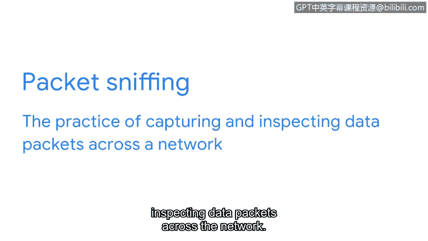

# 046：网络通信基础 🚀

在本节课中，我们将要学习网络通信的基本概念，包括数据包的结构、网络性能的衡量指标以及相关的安全考量。理解这些基础知识是掌握网络安全的关键第一步。

## 网络与通信概述 🌐

网络帮助组织进行通信和连接。但通信也使得网络攻击更有可能发生，因为它为恶意行为者提供了利用脆弱设备和未受保护网络的机会。

## 数据包：网络通信的基本单元 📦

当数据在网络中从一个点传输到另一个点时，就发生了网络通信。数据片段通常被称为数据包。

一个数据包是在网络内从一个设备传输到另一个设备的基本信息单元。当数据通过网络从一个设备发送到另一个设备时，它是以数据包的形式发送的。这个数据包包含了关于它要去往何处、来自何处以及消息内容的信息。

我们可以把数据包想象成一封实体邮件。假设你想给朋友寄一封信。信封上需要有收信人的地址和你的回信地址。信封里面是信纸，上面写着你希望朋友阅读的信息。

数据包与实体信件非常相似，它包含一个**报头**。报头中包含了目的设备的**互联网协议地址**和**媒体访问控制地址**，以及一个**协议编号**，该编号告诉接收设备如何处理数据包中的信息。

接着是数据包的**主体**，它包含了需要传输给接收设备的消息。

最后，在数据包的末尾有一个**报尾**。类似于信件上的签名，报尾向接收设备发出信号，表明数据包已经传输完毕。

## 衡量网络性能 ⚡

数据包在网络中的移动情况可以反映网络的性能表现。

网络性能可以通过**带宽**来衡量。带宽指的是设备每秒接收的数据量。你可以通过以下公式计算带宽：

**带宽 = 数据量 / 时间（秒）**

**速度**指的是数据包被接收或下载的速率。安全人员对网络带宽和速度非常关注，因为如果其中任何一项出现异常，都可能是攻击的迹象。

## 数据包嗅探与安全 🔍

**数据包嗅探**是指捕获和检查网络中数据包的实践。网络上的通信对于共享资源和数据非常重要，因为它使组织能够有效运作。

## 总结与展望 📚

本节课我们一起学习了网络通信的基础。我们了解了数据包的结构，它像一封信件，包含报头、主体和报尾。我们还探讨了如何通过带宽和速度来衡量网络性能，并认识到这些指标的异常可能是安全威胁的信号。最后，我们提到了数据包嗅探这一安全实践。

在接下来的课程中，你将深入学习支持网络通信的各种协议。