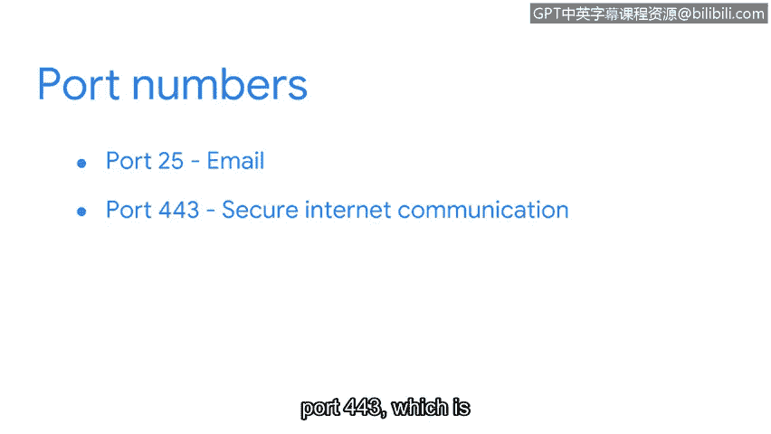
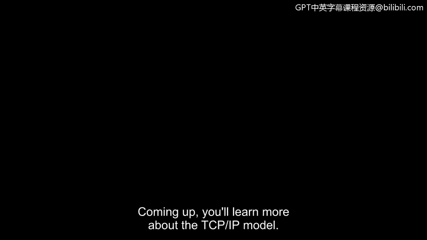

# 047：TCP/IP模型详解 🌐

在本节课中，我们将要学习TCP/IP模型，这是互联网通信的基础标准。我们将了解TCP和IP协议各自的作用，以及端口如何帮助设备管理和处理网络数据。

---

## TCP/IP模型概述

TCP/IP模型是用于网络通信的标准模型。TCP/IP代表传输控制协议和互联网协议。

## 深入理解TCP与IP

上一节我们介绍了TCP/IP模型，本节中我们来看看TCP和IP协议的具体定义。

首先，**TCP**（传输控制协议）是一种互联网通信协议，它允许两台设备建立连接并传输数据流。该协议包含一套组织数据的指令，以便数据能在网络中传输。它还在两台设备间建立连接，并确保数据包到达正确的目的地。

**IP**（互联网协议）则是一套用于在网络设备间路由和寻址数据包的标准。互联网协议中包含**IP地址**，它充当每个私有网络的地址。我们稍后会详细学习IP地址。

## 端口的作用

当数据包在网络中发送和接收时，它们会被分配到端口。在网络设备的操作系统中，**端口**是一个基于软件的位置，用于组织网络设备间的数据发送和接收。

以下是端口的主要功能：
*   端口根据将在两台设备间执行的服务，将网络流量划分为不同的段。
*   发送和接收这些数据段的计算机知道如何根据端口号来优先处理和处理这些段。

这就像给住在公寓楼里的朋友寄信。邮递员不仅知道如何找到大楼，还确切知道在大楼里该去哪里找到你朋友居住的公寓号。

## 端口号与数据包指令

数据包包含告诉接收设备如何处理信息的指令。这些指令以**端口号**的形式存在。

端口号允许计算机分割网络流量，并优先处理它们将对数据执行的操作。

以下是一些常见的端口号：
*   **端口25**：用于电子邮件。
*   **端口443**：用于安全的互联网通信。
*   **端口20**：用于大文件传输。

正如你在本视频中学到的，数据包在网络中传输时包含大量信息和指令。接下来，你将更深入地了解TCP/IP模型。

---

本节课中我们一起学习了TCP/IP模型的核心组成部分。我们了解到TCP负责建立可靠连接和传输数据，IP负责寻址和路由，而端口则像大楼里的具体房间号，帮助设备精确地管理和处理不同类型的网络流量。这些概念共同构成了互联网通信的基础。