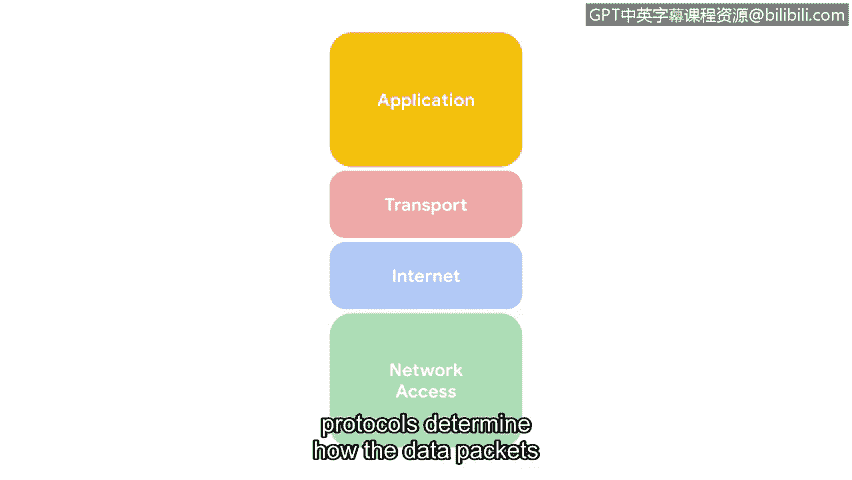

# 048：TCP/IP模型的四层结构

在本节课中，我们将学习TCP/IP模型。这是一个用于理解和组织网络数据如何传输的框架。掌握这个模型有助于安全专业人员识别和解决网络中可能出现的问题。

我们已经讨论了网络的结构以及通信是如何发生的。现在，了解安全专业人员如何识别可能出现的问题非常重要。

TCP/IP模型是一个用于可视化数据如何在网络中组织和传输的框架。

TCP/IP模型有四层。这四层分别是：网络接入层、网际层、传输层和应用层。了解TCP/IP模型如何组织网络活动，能让安全专业人员监控网络并防范风险。

接下来，让我们逐一审视这些层级。

## 网络接入层

第一层是网络接入层。网络接入层处理数据包的创建及其在网络中的传输。这包括连接到物理电缆的硬件设备，以及将数据引导至目的地的交换机。

## 网际层

上一节我们介绍了网络接入层，本节中我们来看看网际层。第二层是网际层。在网际层，IP地址被附加到数据包上，以指示发送方和接收方的位置。网际层还关注网络之间如何相互连接。例如，数据包包含的信息决定了它们是留在局域网内，还是被发送到像互联网这样的远程网络。

## 传输层

接下来是传输层。传输层包含控制网络流量流动的协议。这些协议允许或拒绝与其他设备的通信，并包含有关连接状态的信息。以下是该层的主要活动：

*   **流量控制**：管理数据传输的速率。
*   **错误控制**：确保数据在网络中顺畅流动，检测和纠正传输错误。

## 应用层

最后，在应用层，协议决定了数据包将如何与接收设备交互。

在应用层组织的功能包括文件传输和电子邮件服务。

本节课中，我们一起学习了TCP/IP模型及其四个层级：网络接入层、网际层、传输层和应用层。理解这个模型是分析网络通信和保障其安全的基础。

下个视频再见。