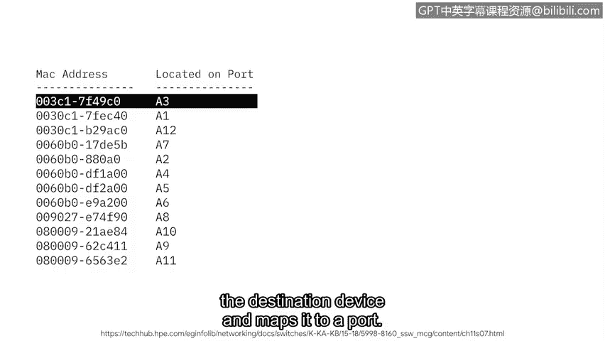

# 049：IP地址与网络通信

在本节课程中，我们将学习IP地址如何用于在网络中进行通信。我们将了解IP地址的类型、作用，以及它们与MAC地址的区别。

## 概述：什么是IP地址？

IP代表互联网协议。一个互联网协议地址，或称IP地址，是一个唯一的字符串，用于标识互联网上设备的位置。互联网上的每个设备都有一个唯一的IP地址，就像街道上的每栋房子都有自己的邮寄地址一样。

## IP地址的类型

IP地址主要有两种类型：IP版本4和IP版本6。

### IPv4地址

IPv4地址由4组1到3位的数字组成，每组数字之间用小数点分隔。例如：`192.168.1.1`。在互联网早期，所有地址都是IPv4格式。但随着互联网的普及，IPv4地址开始被耗尽。

### IPv6地址

为了解决地址耗尽问题，IPv6被开发出来。IPv6地址由32个字符组成。其更长的地址长度允许连接更多的设备到互联网，而不会像IPv4那样快速耗尽地址。例如：`2001:0db8:85a3:0000:0000:8a2e:0370:7334`。

## 公共IP地址与私有IP地址

IP地址可以是公共的，也可以是私有的。

*   **公共IP地址**：由您的互联网服务提供商分配，并与您的地理位置相关联。当您设备上的网络通信发送到互联网时，它们都使用同一个面向公众的地址。就像一所房子里的所有室友共享同一个邮寄地址一样，网络上的所有设备共享同一个公共IP地址。
*   **私有IP地址**：仅在同一本地网络上的其他设备可见。这意味着您家庭网络上的所有设备使用唯一的IP地址相互通信，而这些地址是互联网上其他部分无法看到的。

## MAC地址

除了IP地址，网络通信中使用的另一种地址称为MAC地址。

MAC地址是一个唯一的字母数字标识符，分配给网络上的每个物理设备。当交换机收到一个数据包时，它会读取目标设备的MAC地址，并将其映射到一个端口。然后，交换机会将这些信息保存在一个MAC地址表中。

您可以将MAC地址表想象成一个地址簿，交换机用它来将数据包引导到正确的设备。

## 总结

在本节课程中，我们一起学习了：
1.  **IPv4**和**IPv6**地址的格式及其产生背景。
2.  IP地址在**网络通信**中的作用。
3.  **公共IP地址**与**私有IP地址**的区别。
4.  **MAC地址**的概念及其在局域网内设备寻址中的用途。

理解这些地址是掌握网络如何连接和通信的基础。